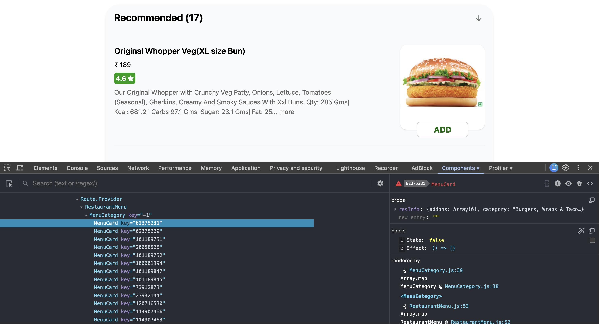

# Higher Order Component (HOC)

-   A Higher Order Component is a **function that takes a component as input and returns a new component**.

-   At the end of the day, it is just a **normal JS function**.

-   **Usage**:  
    It takes an existing component, enhances it by adding extra features or UI, and then returns the enhanced component.

-   It acts like an **"enhancer"**.

## Example

-   On Swiggy’s website, we can see that some restaurants are marked as "promoted".

-   The cards for all restaurants look the same, but promoted restaurants have an extra label/tag on top.

-   This "promoted" information comes directly from Swiggy’s API.

-   So, based on this data, we conditionally add a **"Promoted"** label.

-   We can create a HOC that returns an **enhanced RestaurantCard** with this label.

## Creating a Higher Order Component

`withOpenLabel`:

-   **Input** → `RestaurantCard`
-   **Output** → `EnhancedRestaurantCard`

### Contract

```js
export const withOpenLabel = (RestaurantCard) => {
    return () => {};
};
```

-   `() => {}` represents a **new component** (the enhanced restaurant card).
-   This returned component will return some JSX.

### Implementation

```js
export const withOpenLabel = (RestaurantCard) => {
    return (props) => {
        return (
            <div>
                <label>Open</label>
                <RestaurantCard {...props} />
            </div>
        );
    };
};
```

## Creating a Open Restaurant Card

### 1. Import the Higher Order Component

```js
import RestaurantCard, { withOpenLabel } from "./RestaurantCard";
```

### 2. Use the Higher Order Component

```js
const RestaurantCardOpen = withOpenLabel(RestaurantCard);
```

-   `RestaurantCardOpen` is now a `RestaurantCard` enhanced with an **Open label**.

### 3. Render the enhanced card conditionally

```js
{
    restaurant.info.isOpen ? (
        <RestaurantCardOpen restaurantData={restaurant} />
    ) : (
        <RestaurantCard restaurantData={restaurant} />
    );
}
```

### Notes

-   We are passing props to `RestaurantCardOpen`.
-   Therefore, we must receive those props inside the HOC.
-   The enhanced component receives `props`, which are then forwarded to `RestaurantCard`.

```js
(props) => {
    return (
        <div>
            <label>Open</label>
            <RestaurantCard {...props} />
        </div>
    );
};
```

-   This is the component returned by `withOpenLabel`.

> `props` is an object that contains all the props passed to the wrapped component.

### What does `{...props}` mean?

-   `...` is called the **spread operator** in JS.

It means:

> "Take **all key–value pairs** from the `props` object and pass them individually as props to `RestaurantCard`."

So this:

```jsx
<RestaurantCard {...props} />
```

is equivalent to:

```jsx
<RestaurantCard
    name={props.name}
    rating={props.rating}
    cuisine={props.cuisine}
/>
```

### How does this work at runtime?

Example:

```js
<RestaurantCardOpen name="Domino's" rating={4.5} />
```

#### Flow

1. Props are passed to the HOC.
2. HOC receives:

```js
props = { name: "Domino's", rating: 4.5 };
```

3. HOC renders:

```jsx
<div>
    <label>Open</label>
    <RestaurantCard name="Domino's" rating={4.5} />
</div>
```

## HOCs are pure functions

> [Purity: Components as formulas](https://react.dev/learn/keeping-components-pure#purity-components-as-formulas)

> A pure function does not modify the code or behavior of its input.

-   HOCs **do not change the behavior** of the original component.
-   They only **add extra UI or props** on top of it.
-   The original `RestaurantCard` remains untouched.
-   It will never hamper the `RestaurantCard` directly.

# React App Architecture

-   A React App = **UI Layer + Data Layer**

**The UI layer is powered by the data layer.**

## UI Layer

-   The UI is mostly static.
-   It consists of JSX that defines what appears on the screen.
-   It does not contain any logic by itself.

## Data Layer

-   The data layer includes:

    -   State
    -   Props
    -   Local variables

-   JS logic updates the data layer.
-   Whenever the data layer changes, the UI layer re-renders.

## Building a Collapsible Component

```js
import { useState } from "react";
import MenuCard from "./MenuCard";

const MenuCategory = ({ categoryData }) => {
    const { itemCards, title } = categoryData;
    const [showItems, setShowItems] = useState(true);

    const handleClick = () => {
        setShowItems(!showItems);
    };

    return (
        <div className="px-5 py-4 my-5 bg-gray-50 rounded-4xl shadow-md">
            <div
                className="flex justify-between cursor-pointer"
                onClick={handleClick}
            >
                <h2 className="text-2xl font-bold">
                    {title} ({itemCards.length})
                </h2>
                <span className="text-3xl">
                    <i
                        className="bi bi-arrow-down-short"
                        style={{ color: "#6d756f" }}
                    ></i>
                </span>
            </div>

            {/* Collapsible Content: Rendered always but max height and opacity is 0 if showItems is true. */}
            <div
                className={`grid transition-all ease-in-out duration-700 ${
                    showItems
                        ? "grid-rows-[1fr] opacity-100"
                        : "grid-rows-[0fr] opacity-0"
                }`}
            >
                <div className="overflow-hidden">
                    {itemCards.map((item) => (
                        <MenuCard
                            key={item.card.info.id}
                            resInfo={item.card.info}
                        />
                    ))}
                </div>
            </div>
        </div>
    );
};

export default MenuCategory;
```

**Extension:**



**LHS** → UI Layer  
**RHS** → Data Layer

-   The **React Profiler** records and analyzes the actions performed in a React app.

# Lifting State Up

## Building the Feature

-   We want to build a feature where:

    -   **If one menu category is expanded, all other categories collapse.**

-   When we expand one menu category, all other categories should be aware that another category has been expanded.

-   However, each `MenuCategory` component currently has its **own local state (`showItems`)**.

-   Because of this, each category manages itself independently.

-   So, `CategoryX` has no idea what is happening in `CategoryY`.

<br>

-   To build this feature, we need to **lift the state up**.
-   We will remove the responsibility of controlling `showItems` from the `MenuCategory` component.
-   Instead, we will move this responsibility to its parent component, i.e., `RestaurantMenu`.

> We want the **power to expand and collapse categories** to live in the parent component (`RestaurantMenu`).

-   The parent will pass a value to `MenuCategory` that tells it **whether to show the menu items or not**.

-   This way, `RestaurantMenu` controls all categories instead of each category controlling itself.

**We do not want `MenuCategory` to manage itself anymore. We want `RestaurantMenu` to manage all `MenuCategory` components.**

## MenuCategory as a Controlled Component

```js
import { useState } from "react";
import MenuCard from "./MenuCard";

const MenuCategory = ({ categoryData, showItems }) => {
    const { itemCards, title } = categoryData;
    // No local state

    return (
        <div>
            <div className="flex justify-between cursor-pointer">...</div>

            {/* Collapsible content */}
            <div
                className={`grid transition-all ease-in-out duration-700 ${
                    showItems
                        ? "grid-rows-[1fr] opacity-100"
                        : "grid-rows-[0fr] opacity-0"
                }`}
            >
                <div className="overflow-hidden">
                    {itemCards.map((item) => (
                        <MenuCard
                            key={item.card.info.id}
                            resInfo={item.card.info}
                        />
                    ))}
                </div>
            </div>
        </div>
    );
};

export default MenuCategory;
```

-   `MenuCategory` is now a **controlled component** because its behavior is controlled by its parent.
-   Earlier, when it had its own state, it was an **uncontrolled component** since the parent had no control over it.

## Controlled vs Uncontrolled Components

-   There is no strict definition of controlled and uncontrolled components.

-   It is more of a **design philosophy**.

-   In our project:

    -   `MenuCategory` does not manage the `showItems` state anymore.
    -   The parent (`RestaurantMenu`) controls whether items are shown.
    -   Therefore, `MenuCategory` is considered a **controlled component**.

> It is common to call a component with some local state "uncontrolled". For example, the original `Panel` component with an `isActive` state variable is uncontrolled because its parent cannot influence whether the panel is active or not.
>
> In contrast, you might say a component is "controlled" when the important information in it is driven by props rather than its own local state. This lets the parent component fully specify its behavior. The final `Panel` component with the `isActive` prop is controlled by the `Accordion` component.
>
> Reference: [Controlled and Uncontrolled Components](https://react.dev/learn/sharing-state-between-components#controlled-and-uncontrolled-components)

## Working Logic

-   We want **only one category expanded at a time**.
-   All other categories should remain collapsed.
-   We will use the **index** of the category to achieve this.

### Initial Approach

```js
<div className="menu-body px-65 py-5">
    {categories.map((category, index) => (
        <MenuCategory
            key={category.card.card.categoryId}
            categoryData={category.card.card}
            showItems={index == 0 && true}
        />
    ))}
</div>
```

-   This expands only the first category.
-   Now, this `index` must be changed on the click of the user.

### Making It Dynamic Using State

-   Since the expanded category changes based on user interaction, we need a state variable in the parent.

```js
const [showIndex, setShowIndex] = useState(0);
```

```js
<div className="menu-body px-65 py-5">
    {categories.map((category, index) => (
        <MenuCategory
            key={category.card.card.categoryId}
            categoryData={category.card.card}
            showItems={index === showIndex}
        />
    ))}
</div>
```

## Updating Parent State from Child

-   To expand and collapse categories, we must update `showIndex` when a category is clicked.
-   But a child **cannot directly modify its parent’s state**.

**So how do we do it?**

-   We will modify the value of `showIndex` from `MenuCategory` indirectly.
-   The parent controls the state using `setShowIndex`.
-   We will pass this function to the child as a prop.

```js
<div className="menu-body px-65 py-5">
    {categories.map((category, index) => (
        <MenuCategory
            key={category.card.card.categoryId}
            categoryData={category.card.card}
            showItems={index === showIndex}
            setShowIndex={() => setShowIndex(index)} // Set the 'showIndex' variable with the value of 'index'.
        />
    ))}
</div>
```

### Inside the Child Component

```js
const handleClick = () => {
    setShowIndex();
};
```

-   On click, we simply call the `setShowIndex` prop.
-   This invokes the `setShowIndex()` in the parent, updating `showIndex` with the index of the clicked menu category.
-   With this, React re-renders the parent, and the correct category expands.

## Lifting State Up

-   Whenever multiple components need to stay in sync, we lift the state up to their closest common parent.

> Sometimes, you want the state of two components to always change together. To do it, remove state from both of them, move it to their closest common parent, and then pass it down to them via props.
> This is known as "lifting state up".
>
> Reference: [Sharing State Between Components](https://react.dev/learn/sharing-state-between-components)

# Props Drilling

-   A React app consists of many components arranged in a **tree structure** (there is hierarchy between them).
-   With deep nesting, passing data between components becomes challenging.

## One-Way Data Flow

-   React follows **one-way data flow**.
-   Data flows from **parent to child** (top to bottom).

```js
GrandParent → Parent → Child
```

-   We cannot directly pass data from a grandparent to a deeply nested child.
-   Data must pass through all intermediate components.

### Example

```js
RestaurantMenu → MenuCategory → MenuCard
```

-   To pass data from `RestaurantMenu` to `MenuCard`, we must pass it through `MenuCategory`.

-   If there are many levels of nesting, this becomes cumbersome.

-   The intermediate components may not even use the data.

-   They simply forward it to the next child.

**This process is called Props Drilling.**

-   Props are "drilled" down from the root component to the leaf component.

## When to Avoid Props Drilling

-   Passing props through 1–2 levels is fine.

-   But for deeply nested structures, props drilling becomes hard to manage.

-   In such cases, we use **React Context** to share data without passing props at every level.

# React Context

-   React Context is **kind of like a global place** where data is stored and can be accessed anywhere in the app.

> Context lets a parent component provide data to the entire component tree below it.

-   Examples:

    -   Logged-in user information
    -   Theme (dark / light)

-   These values may be required at many different places in the app.

## Creating Context

-   Context is a **global-level concept**, so we generally do not create it inside `components` folder.

-   We can create contexts inside the `utils` folder.

-   Example: `UserContext` → stores logged-in user information.

-   React provides a utility function called `createContext()` to create a context.

-   While creating a context, we can provide a **default value**.

-   This default value is used when no Provider is found above the component.

```js
import { createContext } from "react";

const UserContext = createContext({
    loggedInUser: "Default User",
});

export default UserContext;
```

-   Now, this context can be accessed anywhere in the app.

## Using Context

-   We use the `useContext()` hook to access a context.

```js
const data = useContext(UserContext);
console.log(data); // { loggedInUser: "Default User" }
```

-   A React app can have **multiple contexts**, so we must specify which context we want to use.

```js
<li>{data.loggedInUser}</li>
```

-   With this, we can access the logged-in user value anywhere in the app.

### NOTE

-   Context is **not truly a global object**.
-   It behaves like a global object.
-   Avoid using the term **"global object"** for context in interviews.

## What Should Go Inside Context?

-   Only put data in context if it is required in **many places**.
-   Do not put everything inside context.
-   Overusing context can make the app harder to debug and maintain.

## Accessing Context Inside Class Components

-   Hooks cannot be used inside class-based components.

-   So, we use `.Consumer` instead.

-   When a context is created, React also provides a `.Consumer`.

-   `.Consumer` uses a callback function that gives access to the context data.

```js
import UserContext from "../utils/UserContext";
```

```js
<p>
    Logged In User:
    <UserContext.Consumer>{(data) => data.loggedInUser}</UserContext.Consumer>
</p>
```

### Summary: Ways to Use Context

1. `useContext()` hook → Functional components (preferred)
2. `.Consumer` → Class-based components

## Updating Data Inside Context

-   To update context values, we use `.Provider`.
-   Just like `.Consumer`, every context has a `.Provider`.

Assume user info is fetched from an API:

```js
const [userInfo, setUserInfo] = useState();

// Authentication

useEffect(() => {
    // Make an API call.
    // Send the username and password to it.
    // Get the data of the user.

    const data = {
        name: "Sansita",
    };

    setUserInfo(data.name);
}, []);
```

-   We will wrap the required part of the app inside `UserContext.Provider`.
-   We can pass the updated value using the `value` prop.

```js
return (
    <div className="app">
        <Header />
        <UserContext.Provider value={{ loggedInUser: userName }}>
            <Outlet />
        </UserContext.Provider>
    </div>
);
```

-   The context is now tied to the `userName` state variable.
-   Whenever `userName` changes, the context value updates automatically.

<br>

-   By wrapping our entire app inside this Provider component, we make the new context value available throughout the app.
-   As a result, all components inside the Provider receive access to this updated value.

<br>

-   Because a Provider is present, components no longer use the default context value.
-   Instead, `loggedInUser` now reflects the **new value** that we have explicitly provided through the Provider.

## Provider Scope Matters

```js
<div className="app">
    <Header />

    <UserContext.Provider value={{ loggedInUser: userName }}>
        <Outlet />
    </UserContext.Provider>
</div>
```

**Result:**

-   Header → Default User
-   Rest of App → Sansita

```js
<div className="app">
    <UserContext.Provider value={{ loggedInUser: userName }}>
        <Header />
    </UserContext.Provider>

    <Outlet />
</div>
```

**Result:**

-   Header → Sansita
-   Rest of App → Default User

<br>

-   Context can be applied to the **entire app** or only a **specific section**.
-   We can create **multiple contexts** for different types of data.
-   Context values can be **overridden at any level** using Providers.

### Nested Providers

```js
// Default Value
<UserContext.Provider value={{ loggedInUser: userName }}>
    {/* Sansita Jain */}
    <div className="app">
        <UserContext.Provider value={{ loggedInUser: "Hello World" }}>
            {/* Hello World */}
            <Header />
        </UserContext.Provider>

        <Outlet />
    </div>
</UserContext.Provider>
```

**Result:**

-   Header → Hello World
-   Rest of App → Sansita Jain

The nearest Provider always overrides outer Providers.

## Changing Context Value Using an Input

-   We want to update the context value using an input field.

-   The context value depends on `userName`, which is updated using `setUserName`.

-   So, to change the value of the context, we need to have `setUserName` function.

-   To allow child components to update the context, we pass `setUserName` through context.

### In `Body` component:

```js
const { loggedInUser, setUserName } = useContext(UserContext);
```

```js
<input
    placeholder="Enter Username"
    value={loggedInUser}
    onChange={(e) => setUserName(e.target.value)}
></input>
```

-   We update the username using the value entered in the input box.
-   This change updates the username **across the entire app**, not just on the Home page (it also reflects on pages like 'About Us').

<br>

-   When the username is displayed on the Grocery page, it also shows the **updated value**.

-   At the time the app initially loads, the Grocery page code is not even be present due to **lazy loading**.

-   Even then, when we update the context value, we are modifying the **global space**.

-   Later, when we navigate to the Grocery page and its code gets loaded, it automatically reads the **latest value from the context**.

-   That’s why the Grocery page shows the updated username without any extra logic.

-   This is one of the **superpowers of React Context**.

-   Even lazily loaded pages (like Grocery) receive the latest context value when they load.

## Data Management Libraries

-   Example: **Redux**

-   Redux provides a central store accessible throughout the app.

-   It is an external library and must be installed separately.

-   For small to medium-sized apps, **Context is usually sufficient**.

**Can we use Context in a large-scale application?**

-   Yes, we can use Context in large applications.
-   However, as the app grows, we often need to create **multiple contexts for different types of data**, such as:

```
ThemeContext
CartContext
UIContext
```

-   While it is possible to manage a large app using multiple contexts, this can become **harder to maintain and scale** over time.
-   That’s why many teams prefer **Redux** for large applications.
-   Redux has become a common industry pattern and provides additional features.
