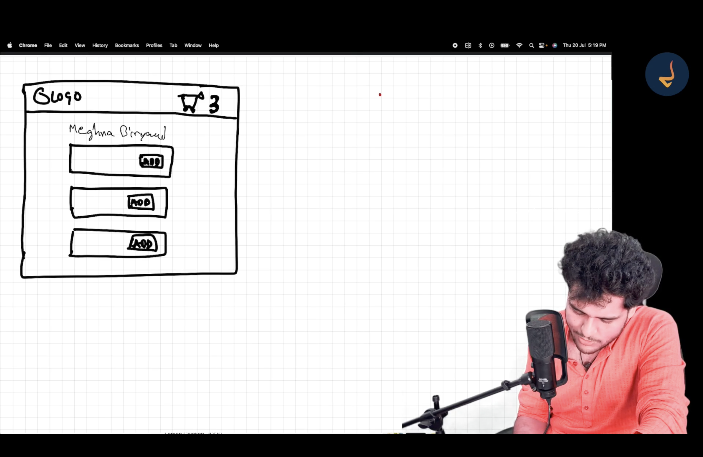
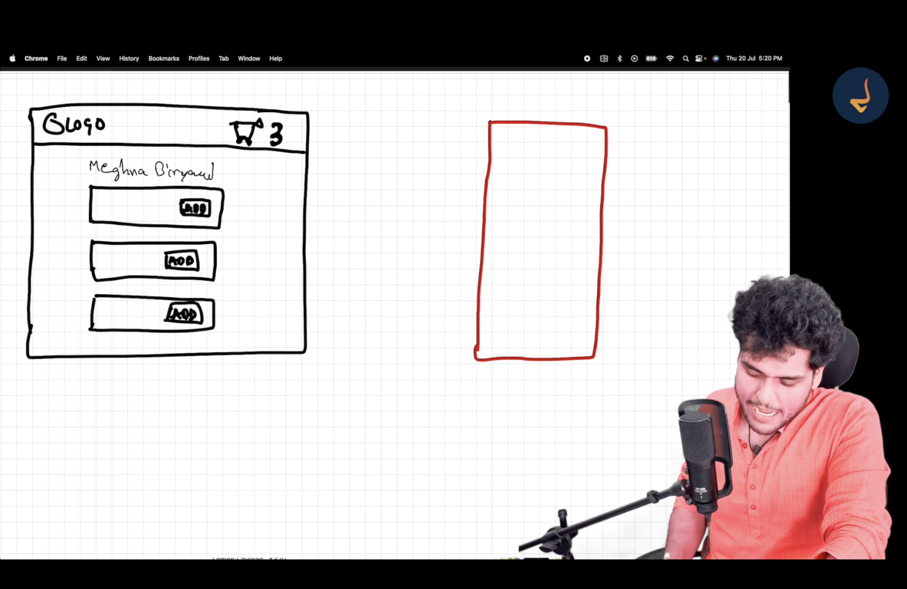
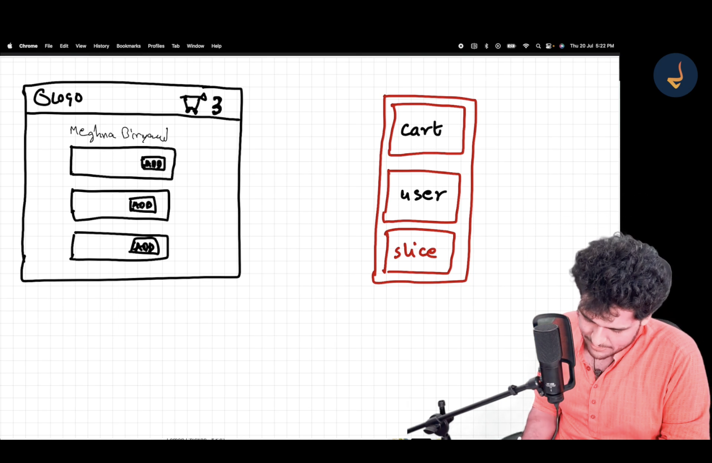
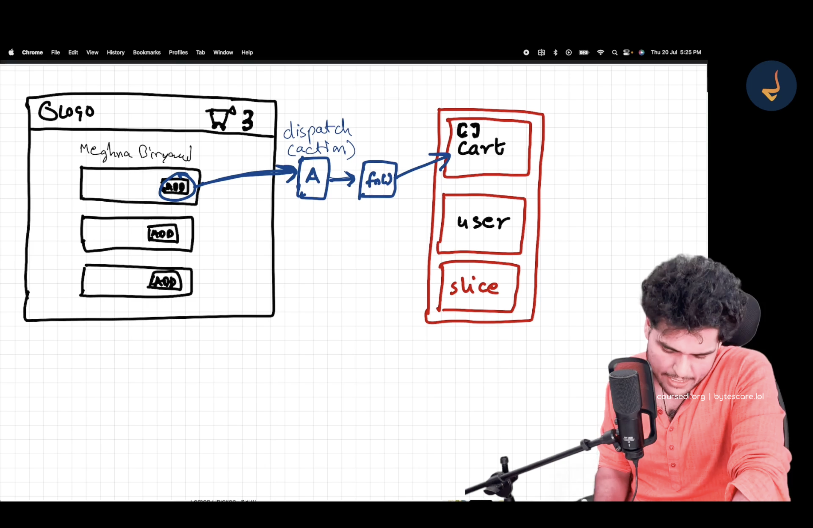
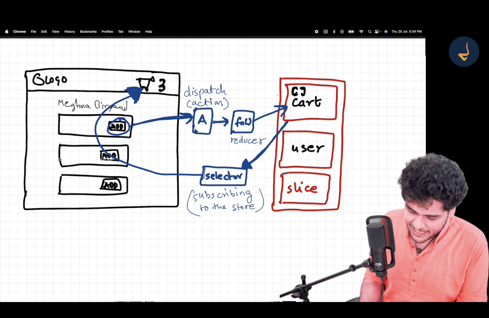
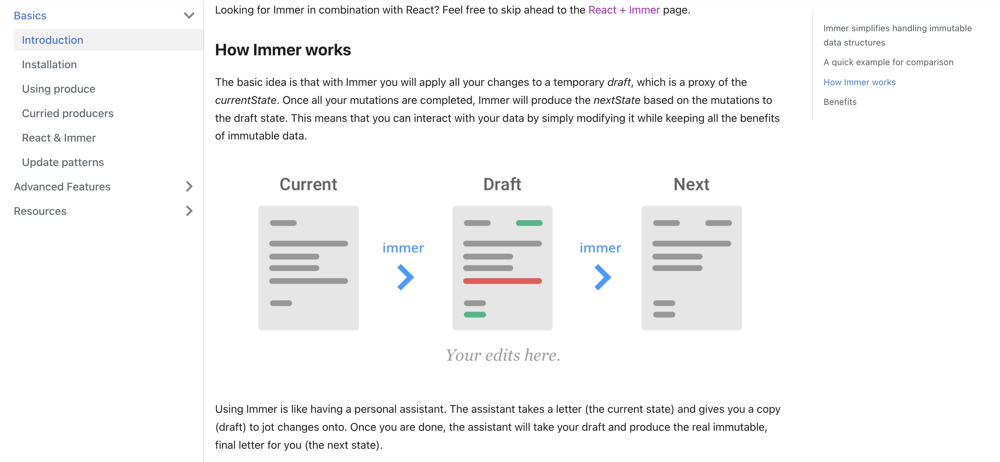
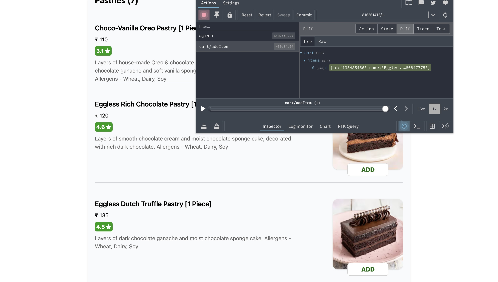
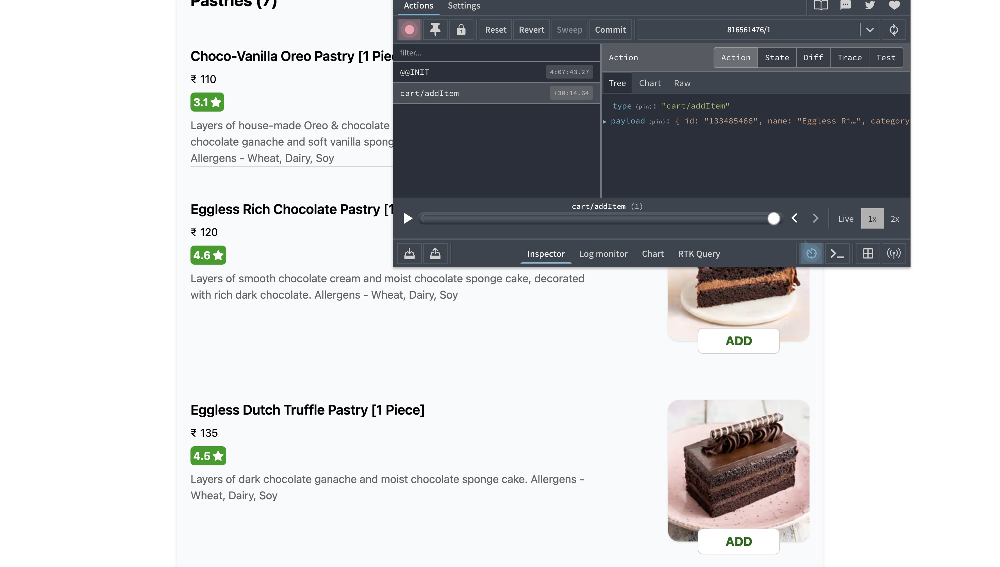
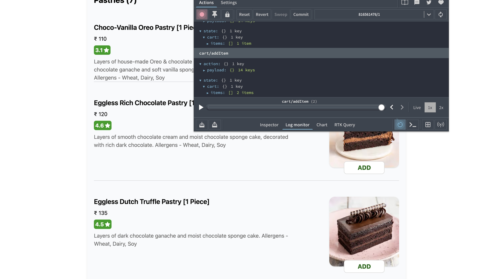
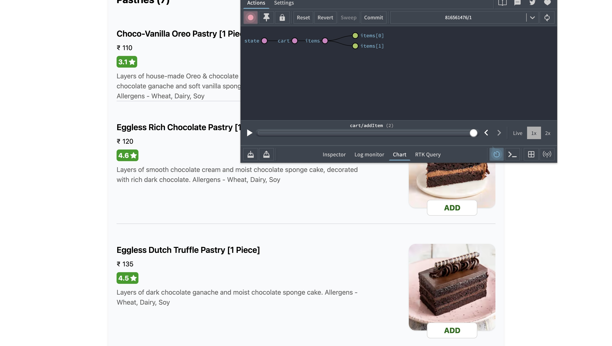

# Redux

-   Redux helps in **handling and managing application state**, especially in **large-scale applications**.
-   Using Redux can make applications **easier to debug**.

### Important Note

**Redux is not mandatory.**

-   We should not start using Redux blindly without evaluating whether the application actually needs it.

**Rule of thumb:**

-   **Small or mid-size applications** → Redux is usually **not required**

-   **Large-scale applications** where data is heavily used (frequent read/write operations across the UI) → Redux can be helpful

-   Any application built using Redux **can also be built without Redux**.

-   Redux should be used **only when required**.

-   Use Redux **wisely**, not by default.

### React vs Redux

-   **React and Redux are two separate libraries.**
-   Redux is **not a part of React**.
-   Redux is also **not the only state management library** available.
-   For example, **Zustand** is another popular library used for state management.

## Redux Libraries

> [https://redux.js.org/](https://redux.js.org/)

The Redux team provides **two main libraries**:

1. **React-Redux**

    - Acts as a **bridge between React and Redux**

    - Allows React components to interact with the Redux store

    > [https://react-redux.js.org/](https://react-redux.js.org/)

2. **Redux Toolkit (RTK)**

    - The **modern, recommended, and standard way** of writing Redux logic

    > [https://redux-toolkit.js.org/](https://redux-toolkit.js.org/)

# Redux Toolkit (RTK)

> ### Purpose
>
> The Redux Toolkit package is intended to be the standard way to write **Redux** logic. It was originally created to help address three common concerns about Redux:
>
> "Configuring a Redux store is too complicated"  
> "I have to add a lot of packages to get Redux to do anything useful"  
> "Redux requires too much boilerplate code"
>
> [https://redux-toolkit.js.org/introduction/getting-started](https://redux-toolkit.js.org/introduction/getting-started)

## Cart Flow Example

Let’s assume this is our application:



-   When we click the **Add** button, the corresponding item should be added to the cart.
-   To store and manage cart data, we will use the **Redux store**.

## Architecture of RTK

### What is a Redux Store?

-   A Redux store is like a **large JS object** that holds application data.
-   It exists in a **central, global space**.
-   Any component in the application can **read from or write to** the store.
-   Most shared or global data is kept inside the Redux store.

Red-colored box represents the Redux Store:



**Is it okay to keep a very large object as the store?**

-   Yes, it is completely fine.
-   Redux is designed to handle large amounts of data in a single store.

However:

-   To avoid the store becoming **cluttered and hard to manage**, we divide it into **Slices**.
-   **Slices** are logical portions or partitions of the Redux store.
-   Each slice manages a specific type of data.

Examples:

-   Cart information → **cart slice**
-   Logged-in user information → **user slice**
-   Theme-related information → **theme slice**



## Cart Slice

-   Initially, the cart slice is empty.
-   As the user adds items, the cart slice gets updated.

### Writing Data to the Store

-   Redux does **not allow direct modification** of the store or its slices.
-   Updates happen in a controlled way.

**Flow:**

1. User clicks the **Add** button
2. An **action is dispatched**
3. The action triggers a function
4. That function updates the cart slice

-   This function is called a **Reducer**.



**Flow summary:**

Click **Add** button → Dispatch action → Reducer runs → Slice is updated

-   As a result, the selected item is added to the **cart slice**.

### Reading Data from the Store

-   We want to show the **number of items in the cart** in the header.

-   Whenever a new item is added, this count should update automatically.

-   To read data from the Redux store, we use a **Selector**.

-   Selectors allow React components to access specific parts of the store.

-   This process is called **subscribing to the store**.



-   When a component (like the Header) uses a selector, it becomes **subscribed to the store**.
-   This means:

    -   If the data in the store changes.
    -   The subscribed component automatically re-renders with the updated data.
    -   So, the component is in sync with the data.

# Build Cart Functionality

## 1. Install RTK and React-Redux

We need to install two libraries:

-   `@reduxjs/toolkit`
-   `react-redux`

**What each library does:**

-   `@reduxjs/toolkit`

    -   Contains all **Redux-related utilities**
    -   Example: Creating a store is a Redux task, so `configureStore` comes from Redux Toolkit

-   `react-redux`

    -   Acts as a **bridge between React and Redux**
    -   Example: To provide the Redux store to the React app, we use `Provider` from `react-redux`

```bash
npm i @reduxjs/toolkit
npm i react-redux
```

## 2. Build Our Store

```js
import { configureStore } from "@reduxjs/toolkit";

const appStore = configureStore();

export default appStore;
```

-   We use `configureStore()` to create our Redux store.

## 3. Connect the Store to the App

### Providing the Store to the App

```js
import { Provider } from "react-redux";
```

-   `Provider` accepts the Redux store via the `store` prop.
-   We pass `appStore` to `Provider` so that all child components can access the store.

```js
return (
    <Provider store={appStore}>
        <UserContext.Provider value={{ loggedInUser: userName, setUserName }}>
            <div className="app">
                <Header />
                <Outlet />
            </div>
        </UserContext.Provider>
    </Provider>
);
```

-   Here, we have wrapped our **entire app** with the Redux `Provider`.
-   This allows any component inside the app to access the Redux store.
-   Similar to React Context, we can also wrap **only a specific portion** of the app if needed.

## 4. Create Cart Slice

```js
import { createSlice } from "@reduxjs/toolkit";

const cartSlice = createSlice();
```

-   `createSlice()` is used to create a slice of the Redux store.
-   It takes a **configuration object** as an argument.

### Configuration Options

`createSlice()` mainly needs three things:

#### 1. Name of the Slice

-   A unique name to identify this slice inside the Redux store.

#### 2. Initial State of the Slice

-   Defines the initial structure and values of the slice.
-   For the cart, we start with an empty array of items.

```js
initialState: {
    items: [],
}
```

-   `items` represents all the products added to the cart.

#### 3. Reducers

-   It has reducer functions corresponding to each action.

-   `reducers` is an object.

-   Each key represents an **action**.

-   Each value is a **reducer function** mapped to that action.

-   Actions are like small APIs used to communicate with the Redux store.

-   Common cart actions can be:

    -   Add item
    -   Remove item
    -   Clear cart

```js
reducers: {
    // action: reducer function
    addItem: () => {},
}
```

-   Here:

    -   `addItem` → action name
    -   `() => {}` → reducer function for that action

### Reducer Function

-   A reducer function modifies the data inside its slice of the store.
-   It receives two arguments:

    -   `state` → current state of the slice
    -   `action` → dispatched action (contains `type` and `payload`)

-   Based on the action, the reducer updates the state.

#### Adding an Item to the Cart

```js
addItem: (state, action) => {
    state.items.push(action.payload);
},
```

-   `action.payload` contains the data passed while dispatching the action.
-   When the **Add** button is clicked, we dispatch `addItem` with the item data.

<br>

-   Here, we are **directly mutating the state**.
-   This is allowed in Redux Toolkit because it uses **Immer** internally, which safely converts mutations into immutable updates.

### Cart Slice (Complete)

```js
const cartSlice = createSlice({
    name: "cart",
    initialState: {
        items: [],
    },
    reducers: {
        addItem: (state, action) => {
            state.items.push(action.payload);
        },

        removeItem: (state, action) => {
            state.items = state.items.filter((item) => item !== action.payload);
        },

        clearCart: (state) => {
            state.items.length = 0; // Empties the items array
        },
    },
});
```

### Exporting from the Slice

We export two things:

1. **Actions**
2. **Reducer**

```js
export const { addItem, removeItem, clearCart } = cartSlice.actions;
export default cartSlice.reducer;
```

-   `cartSlice.actions` is an object containing all actions.
-   We use object destructuring to extract individual actions.

### What Does `createSlice()` Return?

`createSlice()` returns an object that looks like this:

```js
{
    actions: {
        addItem,
        removeItem,
        clearCart,
    },
    reducer,
}
```

-   `actions` → all actions created
-   `reducer` → reducer function for this slice

### Adding `cartSlice` to the Store

-   To update the Redux store, we need reducers.
-   The store reducer is a **combination of reducers from different slices**.

```js
const appStore = configureStore({
    reducer: {},
});
```

-   This `reducer` is responsible to modify our `appStore`.

#### Example with Multiple Slices

```js
const appStore = configureStore({
    reducer: {
        // sliceName: sliceReducer
        cart: cartReducer,
        user: userReducer,
    },
});
```

-   `cart` and `user` are slice names.
-   `cartReducer` and `userReducer` are reducers exported from their respective slices.

## 5. Read Data Using Selector

-   To read data from the Redux store, we need to **subscribe to the store**.
-   This is done using a **selector**.
-   A selector is simply a function used to extract **specific data** from the Redux store.
-   It takes the entire Redux state as an argument and returns only the required slice of data.

### `useSelector` Hook

```js
import { useSelector } from "react-redux";
```

-   In functional components, we use the `useSelector` hook to access data from the Redux store.
-   We pass a **selector function** to `useSelector`.
-   `useSelector` then returns the selected piece of state.

```js
const cartItems = useSelector((store) => store.cart.items);
```

-   Here, we are selecting only a **small portion of the store**.

-   We only need the `items` array from the `cart` slice.

-   This means the component is now **subscribed to `store.cart.items`**.

-   Whenever `cart.items` changes, this component will automatically re-render.

```js
<span className="text-lg">{cartItems.length}</span>
```

## 6. Dispatch an Action

-   When the user clicks the "Add" button, we need to **dispatch an action**.

```js
const handleAddItem = () => {
    // Dispatch an action
};
```

-   To dispatch an action, we need the `dispatch` function.
-   We get it using the `useDispatch()` hook.

```js
import { useDispatch } from "react-redux";
```

```js
const dispatch = useDispatch();
```

-   `dispatch` is a function used to send actions to the Redux store.

### Dispatching the `addItem` Action

-   First, we import the action.

```js
import { addItem } from "../utils/cartSlice";
```

-   Then we dispatch the action inside the click handler.

```js
const handleAddItem = () => {
    dispatch(addItem("pizza"));
};
```

-   Whatever value we pass to `addItem()` becomes the **payload** of the action.
-   In this case, `"pizza"` is the payload.
-   This payload is then added to the `items` array in the store.

### How Does the Reducer Receive This Data?

From the `cartSlice`:

```js
addItem: (state, action) => {
    state.items.push(action.payload);
},
```

-   The reducer function always receives:

    1. `state` → current state of the slice
    2. `action` → the dispatched action object

-   We might think that we manually pass `state` and `action` while dispatching, but **Redux handles this internally**.

### What Redux Does Internally

When we write:

```js
dispatch(addItem("pizza"));
```

Redux internally creates an action object like this:

```js
{
    type: "cart/addItem",
    payload: "pizza" // Our specified value
}
```

-   This object is then passed to the reducer as the `action` argument.

-   So inside the reducer:

    -   `action.payload` → `"pizza"`

-   Redux abstracts all of this logic for us.

-   We only focus on **dispatching actions** and **writing reducers**.

## Summary

-   Clicking the **Add** button dispatches the `addItem` action.
-   The reducer function updates the `cart.items` array.
-   The Header component is subscribed to `cart.items` using a selector.
-   When the cart updates, the item count updates automatically.

This is the complete **read–write cycle** in Redux.

# Mistakes While Using Redux

## 1. Subscribing to the Whole Store

-   While subscribing to the Redux store, always make sure you subscribe to the **exact portion of the store that you need**.
-   Subscribing to unnecessary parts of the store can lead to **performance issues**.
-   This is an important place where we can **optimize performance**.

### Correct Way (Recommended)

```js
const cartItems = useSelector((store) => store.cart.items);
```

### Less Efficient Way

```js
const store = useSelector((store) => store);
const cartItems = store.cart.items;
```

-   In the above code, we are subscribing to the **entire Redux store** and then extracting `items` from it.
-   Although this works, it is **less efficient**.

### Why is this a problem?

When we write:

```js
const store = useSelector((store) => store);
```

-   The `store` variable is now subscribed to the **entire Redux store**.
-   Whenever **any slice** of the store changes, the component will re-render.
-   Even if the `cart` slice does not change, the component will still update.

Example:

-   Suppose `userSlice` changes due to a login action.
-   The `Cart` component has nothing to do with `userSlice`.
-   Still, the `Cart` component will re-render unnecessarily.

### Better Approach

-   Subscribe only to the **required slice** of the store.

```js
const cartItems = useSelector((store) => store.cart.items);
```

-   Now, the component will re-render **only when `store.cart.items` changes**.
-   This is more efficient and improves performance.
-   It is called a **selector** because we are selecting a specific portion of the store.

## 2. `reducer` vs `reducers`

### Store Level (`reducer`)

```js
const appStore = configureStore({
    reducer: {
        cart: cartReducer,
        // user: userReducer,
    },
});
```

-   In `configureStore`, we use the keyword **`reducer`** (singular).
-   This represents **one big reducer for the entire Redux store**.
-   Internally, this big reducer is a combination of multiple slice reducers.

### Slice Level (`reducers`)

```js
const cartSlice = createSlice({
    name: "cart",
    initialState: {
        items: [],
    },
    reducers: {
        addItem: (state, action) => {
            state.items.push(action.payload);
        },

        removeItem: (state, action) => {
            state.items.filter((item) => item != action.payload);
        },

        clearCart: (state) => {
            state.items.length = 0;
        },
    },
});
```

-   Inside a slice, we define **multiple reducer functions**.
-   That’s why the keyword used here is **`reducers`** (plural).
-   Each key inside `reducers` represents:

    -   an **action**
    -   and its corresponding **reducer function**

### Exporting the Reducer

```js
export default cartSlice.reducer;
```

-   `cartSlice.reducer` is a **single combined reducer** created from all reducer functions inside the slice.
-   This combined reducer is what we provide to the store.

# Problem with State (Redux & Redux Toolkit)

-   In **vanilla Redux (older Redux)**, Redux used to give clear warning that:

> **Do not mutate state**

```js
addItem: (state, action) => {
    state.items.push(action.payload); // Prohibited in vanilla Redux
};
```

-   This reducer is considered **impure** because it directly mutates the input `state`.

## How State Was Handled in Vanilla Redux

-   In vanilla Redux, we **never modified the state directly**.
-   Instead, we followed these steps:

1. Create a **copy** of the state
2. Modify the copy
3. **Return** the new state

```js
addItem: (state, action) => {
    const newState = [...state];
    newState.items.push(action.payload);
    return newState;
},
```

-   State mutation was not allowed.
-   Returning a new state object was **mandatory**.

## Redux Toolkit Changes This

-   In Redux Toolkit (RTK), we **do mutate the state directly**.
-   Returning the state is **not mandatory** anymore.

```js
addItem: (state, action) => {
    state.items.push(action.payload); // Allowed in RTK
};
```

-   This looks like mutation, but Redux Toolkit **handles immutability internally**.

### How Does Redux Toolkit Do This?

-   Redux Toolkit uses a library called **Immer**.

> Immer is a tiny package that allows you to work with immutable state in a more convenient way.
>
> [https://immerjs.github.io/immer/](https://immerjs.github.io/immer/)

-   Behind the scenes:

    -   Immer creates a **proxy** of the state
    -   Tracks changes made to it
    -   Produces a **new immutable copy** of the state
    -   Redux then uses this new state



> https://immerjs.github.io/immer/#how-immer-works

-   So, Redux Toolkit is still doing the same 3 steps as vanilla Redux:

    1. Copy
    2. Modify
    3. Return

**But this logic is completely abstracted away from the developer**

## Important Caveat: Reassigning State Doesn’t Work

```js
clearCart: (state) => {
    state = { items: [] };
};
```

-   This will **not** update the Redux state.
-   This only changes the **local copy** of the `state` variable.
-   It does **not mutate** the original state tracked by Immer.

### Why This Happens

-   The `state` parameter is a **local variable** pointing to an Immer proxy.
-   Reassigning it does not affect the actual state.

Example original state:

```js
{
    items: ["pizza"];
}
```

Debugging example:

```js
clearCart: (state) => {
    console.log(state); // Logs the proxy obj (b/z immer BTS creates a proxy obj)
    console.log(current(state)); // Logs actual state

    state = { items: [] };

    console.log(state); // Logs { items: [] }
    // Original Redux state is unchanged
};
```

-   It logs an empty array, but the original state does not change because the `state` variable is only a local copy.
-   Any modifications made to `state` are local and do not affect the actual store state.
-   Therefore, the original state remains unchanged.

### Important Note

-   Directly logging `state` shows a **proxy object**
-   To see the real state, use `current()`
-   `current()` must be imported from `@reduxjs/toolkit`

```js
import { current } from "@reduxjs/toolkit";
```

## Correct Ways to Clear the Cart in RTK

Redux Toolkit allows **two valid approaches**:

### 1. Mutate the Existing State (Recommended)

```js
clearCart: (state) => {
    state.items.length = 0;
};
```

-   This directly mutates the proxy
-   Immer detects the change and creates a new immutable state

### 2. Return a New State Object

```js
clearCart: () => {
    return {
        items: [],
    };
};
```

-   Whatever is returned **replaces the original state completely**

### Final State After Either Approach

```js
{
    items: [];
}
```

## Key Takeaways

-   Vanilla Redux → **No mutation, must return new state**
-   Redux Toolkit → **Mutation allowed, return optional**
-   Immer handles immutability behind the scenes
-   Reassigning `state` does nothing
-   Either **mutate the proxy** or **return a new state**

## Redux DevTools

-   Redux helps a lot with **debugging**, especially as the application grows.

-   When an app becomes large, many components may:

    -   dispatch actions to the same slice
    -   subscribe to the same part of the store

-   This makes debugging very difficult without proper tools.

-   Redux provides a Chrome extension called **Redux DevTools**, which offers powerful debugging capabilities.

### What Redux DevTools Shows

#### 1. Action Log

-   A complete log of all actions dispatched in the app.

```js
sliceName / actionName;
```

Example:

```js
cart / addItem;
```

#### 2. Current (Updated) State

-   Displays the **updated state** after an action is dispatched.


Shows the new state after adding one item.

#### 3. State Diff

-   Displays the **difference** between the previous state and the new state.



-   Newly added data appears in **green**.

#### 4. Action Details

-   Shows:

    -   action type
    -   payload



#### 5. Trace

-   Shows **which component or function** dispatched the action.
-   Useful for tracking the source of a bug.

#### 6. Test

-   Helps in writing **test cases** based on dispatched actions.

#### 7. Log Monitor

-   Displays a readable log of actions and state changes.



#### 8. Chart

-   Visualizes state changes over time using charts.



#### 9. Action Replay (Time Travel)

-   Allows moving **forward and backward** through dispatched actions.

-   We can replay how the state evolved step by step.

-   Example:

    -   User adds items on the **restaurant page**.
    -   Cart state updates even though the **cart page is not open**.
    -   Redux DevTools still shows how the cart state changes.

-   This helps simulate real user behavior and understand how actions affect the app.

#### 10. Jump To / Skip Actions

-   Jump directly to any action in the history.
-   Skip certain actions to see how the app behaves without them.

> Read about **RTK Query**
>
> https://redux-toolkit.js.org/rtk-query/overview
