# Testing

## Types of Developer Testing

> We are only concerned with **developer testing** here.

## 1. Manual Testing

- As developers, we test our website manually.
- This is **not efficient**.
- After making a small change or adding a new feature, we need to test all features and pages again.

This is because:

- Adding even a single line of code can introduce bugs anywhere in the app.

### Why?

- When a React app grows large, it may contain **100s of components**.
- These components communicate with each other.
- So changing one line of code may introduce bugs in completely different parts of the application because components are interconnected.

#### Example:

- Changing a small piece of code inside the click handler of an "Add" button could affect:
    - The Accordion component
    - The Cart page

Because they are related through shared state or props.

That’s why **testing is very important**, especially in large-scale applications.

## 2. Automated Testing

- Writing test cases that test our code automatically.
- Basically, it is **code that tests our application code**.

There are 3 main types of automated testing:

1. Unit Testing
2. Integration Testing
3. End-to-End Testing (E2E)

# 1. Unit Testing

- We test React components **in isolation**.
- Testing one specific component (one unit of the app).

**Example:**

- Testing the `Header` component alone.

# 2. Integration Testing

- Testing the **integration between multiple components**.
- Multiple components interact with each other.
- We test a specific user flow or feature.

**Example:**

- Testing the restaurant search feature.
- Many components work together to make this feature function properly.

# 3. End-to-End Testing (E2E Testing)

- Testing the entire application from the user's perspective.
- Testing the React application from the moment a user lands on the site until they leave the website.

**Example user flow:**

User enters the site → Login → Search restaurants → Add items to cart → Checkout

- Testing the complete user journey.
- Requires different tools such as:
    - Cypress
    - Puppeteer
    - Selenium

> As developers, we are mostly concerned with **Unit Testing** and **Integration Testing**.

# Libraries Used for Testing

## 1. React Testing Library

[https://testing-library.com/docs/react-testing-library/intro](https://testing-library.com/docs/react-testing-library/intro)

```bash
npm i -D @testing-library/react @testing-library/dom
```

- The most standard library to write test cases in React applications.

### History

- There used to be a **DOM Testing Library**.
- React Testing Library is built on top of DOM Testing Library.
- It acts as a wrapper and provides additional React-specific utilities.
- So, DOM Testing Library is the base of all testing libraries.

<br>

- If we use **Create React App (CRA)**, React Testing Library comes pre-installed.
- Since we built our project from scratch, we need to install and configure it manually.

<br>

- React Testing Library uses **Jest** behind the scenes.

## 2. Jest

> Jest is a delightful JavaScript testing framework with a focus on simplicity.

```bash
npm i -D jest
```

- Jest is the standard framework for writing JS test cases.
- It is a complete JS testing framework.
- React Testing Library uses Jest.

# Babel Setup

Jest uses Babel internally.

So, we need to install Babel dependencies:

```bash
npm i -D babel-jest @babel/core @babel/preset-env
```

## Configure Babel

Create `babel.config.js`:

```js
module.exports = {
    presets: [["@babel/preset-env", { targets: { node: "current" } }]],
};
```

**Note:**

A large-scale application is not built only with React.
It requires multiple libraries and frameworks for different tasks.

## Parcel & Babel Conflict

- Parcel also uses Babel internally.
- When we install and configure Babel for Jest, it can conflict with Parcel's default Babel configuration.

### Why?

- Parcel has its own internal Babel configuration.
- When we add `babel.config.js`, it may try to override Parcel’s configuration.

## Solution

> [https://parceljs.org/languages/javascript/#babel](https://parceljs.org/languages/javascript/#babel)

> [https://parceljs.org/languages/javascript/#usage-with-other-tools](https://parceljs.org/languages/javascript/#usage-with-other-tools)

- We need to tell Parcel to use our Babel configuration properly.

- This requires making changes to Parcel’s configuration settings.

Modify or create a `.parcelrc` file:

```json
{
    "extends": "@parcel/config-default",
    "transformers": {
        "*.{js,mjs,jsx,cjs,ts,tsx}": [
            "@parcel/transformer-js",
            "@parcel/transformer-react-refresh-wrap"
        ]
    }
}
```

This prevents conflicts between Parcel’s default Babel setup and our custom configuration.

# Steps to Set Up Testing

1. Install React Testing Library
2. Install Jest
3. Install Babel dependencies
4. Configure Babel (`babel.config.js`)
5. Configure Parcel (`.parcelrc`)
6. Initialize Jest configuration
7. Install jsdom
8. Install `@babel/preset-react` (to make JSX work) and include it in Babel config

## Running Tests

Add this in `package.json`:

```json
"scripts": {
  "test": "jest",
  "start": "parcel index.html",
  "build": "parcel build index.html"
}
```

Run tests using:

```bash
npm run test
```

# Jest Configuration

To initialize Jest configuration:

```bash
npx create-jest
```

> Earlier, we used:

```bash
npx jest --init
```

After running the command:

- It will ask a few configuration questions.
- A `jest.config.js` file will be created.
- This file contains Jest configuration settings.

## jsdom

[https://www.npmjs.com/package/jsdom](https://www.npmjs.com/package/jsdom)

- When running test cases, there is **no real browser or server**.

- Tests run in a simulated environment.

- For that, we use **jsdom**.

- jsdom is like a browser but it is not a real browser.

- It simulates browser-like APIs (DOM, window, document).

- All our testing code will run in jsdom.

### Example:

- If we are testing a `Header` component:
    - It will first render inside jsdom.
    - Then the test cases will execute on it.

## Install jsdom (Jest 28+)

[https://testing-library.com/docs/react-testing-library/setup#jest-28](https://testing-library.com/docs/react-testing-library/setup#jest-28)

On above website, it is written:

> If you're using Jest 28 or later, jest-environment-jsdom package now must be installed separately.

- Install it:

```bash
npm install --save-dev jest-environment-jsdom
```

# Writing Test Cases

## Where Do We Write Test Cases?

- We write test cases inside the `__tests__` folder.
- All files inside this folder are automatically tracked by Jest.
- Any file with the following names is considered a test file:
    - `.js`
    - `.ts`
    - `.test.js`
    - `.test.ts`
    - `.spec.js`
    - `.spec.ts`

> Jest also detects files with `.test` or `.spec` even outside `__tests__`, but keeping them inside `__tests__` is a common convention.

**NOTE:**

- `__` is called **dunder** (short for "double underscore").
- The term comes from Python, where special methods like `__init__` and `__str__` are surrounded by double underscores.

## Creating a Test File

- Create `sum.test.js` to test `sum.js`.

### How We Write a Test Case

```js
test("Sum function should calculate the sum of two numbers", () => {});
```

The `test()` function takes **2 arguments**:

1. A description (string) - explains what the test does.
2. A callback function - contains the actual test logic.

#### Writing Logic Inside the Callback

Steps:

1. Call the function you want to test.
2. Store the result.
3. Compare it with the expected value using an assertion.

```js
() => {
    const result = sum(10, 20);
    expect(result).toBe(30); // I expect my result to be 30
};
```

- `expect(result).toBe(30);` is called an **assertion**.

#### Complete Example

```js
import { sum } from "../sum";

test("Sum function should calculate the sum of two numbers", () => {
    const result = sum(10, 20);
    expect(result).toBe(30);
});
```

When we run `npm run test`:

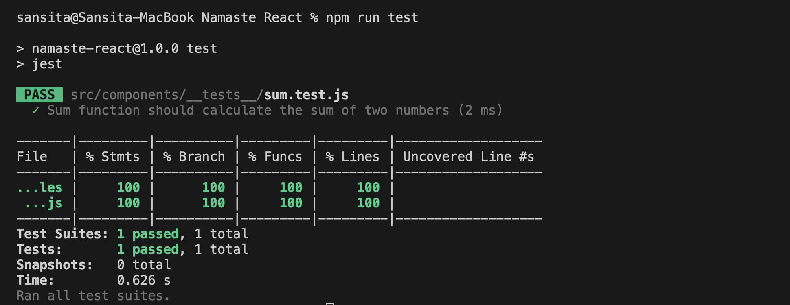

Failing scenario:

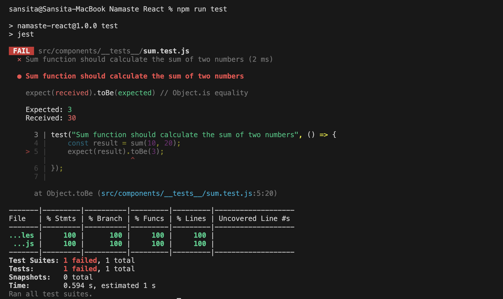

- If everything is correct → PASS
- If the expected value doesn’t match → FAIL

#### Important Note About Assertions

- It is **not compulsory** to write an assertion.
- If we write an empty test case, it will still pass.
- If there is no `expect()` statement, Jest will still mark it as passed.

However:

> Practically, a test case should always contain assertions. Otherwise, we are not actually verifying anything.

# Writing Test Cases for React Components

To test a React UI component:

1. First, render it into JSDOM.
2. Then query elements.
3. Then assert expected behavior.

We use `render()` from React Testing Library.

## Example: Testing a Contact Component

```js
import Contact from "../Contact";
import { render } from "@testing-library/react";

test("Should load the contact us component", () => {
    render(<Contact />);
});
```

This renders the component into **JSDOM** (a simulated browser environment).

### Querying Elements with `screen`

To test whether the heading is rendered:

```js
import Contact from "../Contact";
import { render, screen } from "@testing-library/react";

test("Should load the contact us component", () => {
    render(<Contact />);

    const heading = screen.getByRole("heading");
    expect(heading).toBeInTheDocument();
});
```

### Explanation

- `screen` is an object which is provided by React Testing Library.
- It queries elements from the rendered JSDOM.
- With `screen.`, we can find some info about what has been rendered on the page.

- `getByRole("heading")` searches for elements with the ARIA role of "heading" (`<h1>` to `<h6>`).

If:

- No matching element is found → it throws an error.
- More than one matching element is found → it throws an error.

<br>

- `toBeInTheDocument()` checks whether the specified element is present in the document (screen) or not.

## What Is Happening Behind the Scenes?

When we run `npm test`:

- A real browser (like Chrome) is **not** opened.
- Instead, tests run in a simulated environment called **JSDOM**.

### Flow:

1. We write `<Contact />`
2. `render(<Contact />)` converts JSX into HTML
3. That HTML is injected into a virtual `<body>` inside JSDOM
4. `screen` queries that virtual DOM

## Error 1: JSX Not Supported

We might see an error saying JSX is not enabled:

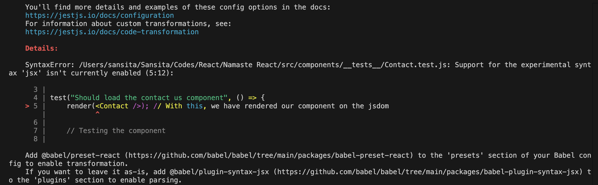

This happens because Jest does not understand JSX by default.

### Solution:

Install:

```bash
npm i -D @babel/preset-react
```

Update `babel.config.js`:

```js
module.exports = {
    presets: [
        ["@babel/preset-env", { targets: { node: "current" } }],
        ["@babel/preset-react", { runtime: "automatic" }],
    ],
};
```

#### Why Do We Need `@babel/preset-react`?

- Babel is a transpiler.
- It converts modern JS (and JSX) into code that Jest can understand.
- JSX like:

```js
render(<Contact />);
```

must be converted into regular JS before execution.

`@babel/preset-react` handles that conversion.

## Error 2: `toBeInTheDocument` Is Not Defined

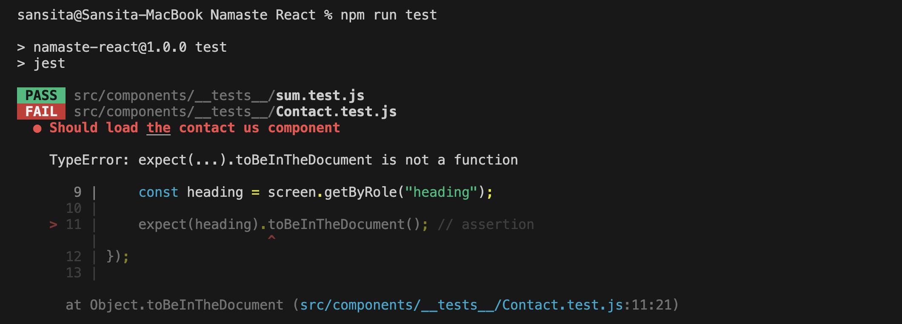

That means Jest does not know about that matcher.

### Solution:

Install:

```bash
npm i -D @testing-library/jest-dom
```

Then import it in the test file (or setup file):

```js
import "@testing-library/jest-dom";
```

Now `toBeInTheDocument()` will work.

## Query Methods

### `getByRole()`

- There are different types of roles in HTML.
- These roles are based on **ARIA roles** (accessibility roles).
- React Testing Library uses these roles to query elements.

- `getByRole()` returns a single DOM element node (an `HTMLElement`).

> [https://developer.mozilla.org/en-US/docs/Web/API/HTMLElement](https://developer.mozilla.org/en-US/docs/Web/API/HTMLElement)

> The HTMLElement interface represents any HTML element. Some elements directly implement this interface, while others implement it via an interface that inherits it.

### `getByText()`

```js
const button = screen.getByRole("button");
const button = screen.getByText("Submit");
```

- `getByText()` searches for an element containing the given text.
- If the text exists anywhere on the screen, it returns that HTML element.
- It is **case-sensitive** by default.

#### Example (Failing Case)

```js
test("Should load the button inside contact component", () => {
    render(<Contact />);

    const button = screen.getByText("submit");

    expect(button).toBeInTheDocument();
});
```

This will **fail** because:

- The actual text is `"Submit"` (capital S).
- `getByText("submit")` will not match `"Submit"`.

When it fails, Jest prints the DOM rendered in JSDOM to help debug:

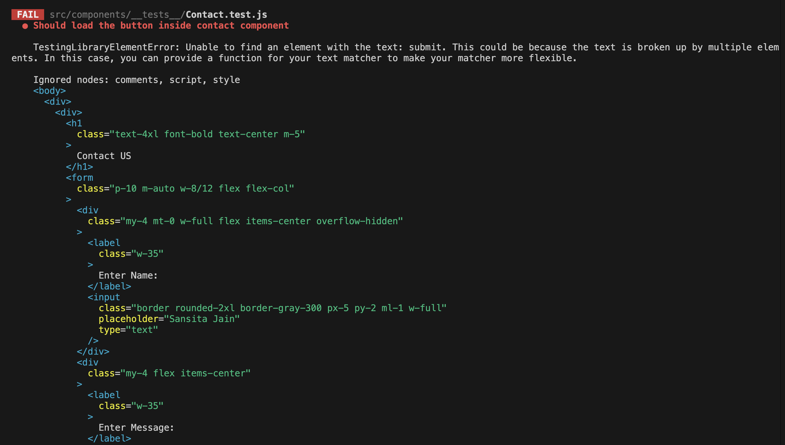

### `getByPlaceholderText()`

```js
test("Should load the input inside contact component", () => {
    render(<Contact />);

    const input = screen.getByPlaceholderText("Sansita Jain");

    expect(input).toBeInTheDocument();
});
```

- It searches for an input element by its `placeholder` attribute.

### `getAllByRole()`

```js
const inputElements = screen.getAllByRole("textbox"); // This is called querying.
console.log(inputElements);
```

- Returns **all matching elements** as an array.
- The role for an `<input type="text" />` element is `"textbox"`.

- Jest shows us that we have 2 elements with the role = "textbox":

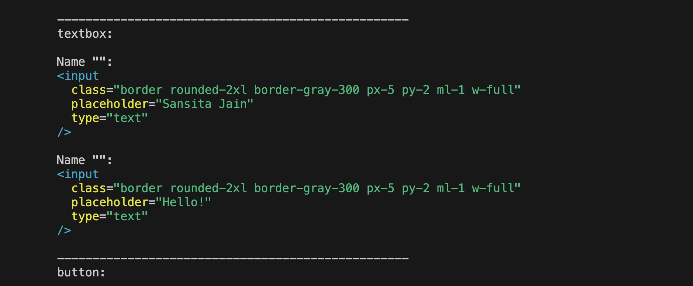

There are 2 input fields, so:

- It returns an array of 2 elements.
- Each item is an `HTMLInputElement`.

> These query methods return **real DOM elements (HTML elements)** from JSDOM.

#### Example

```js
test("Should load 2 input boxes inside contact component", () => {
    render(<Contact />);

    const inputElements = screen.getAllByRole("textbox");

    expect(inputElements.length).toBe(2);
});
```

We can also write:

```js
expect(inputElements.length).not.toBe(3);
```

## 3 Basic Steps of Testing a React Component

1. **Render** something
2. **Query** the DOM
3. **Assert** the expected result

Render → Query → Assert

# Managing Test Cases

When the number of test cases increases, it becomes difficult to manage them.

To organize them, we use `describe()`.

## `describe()` Block

- Used to group related test cases.
- Takes:
    1. A name (string)
    2. A callback function

### Example

```js
import Contact from "../Contact";
import { render, screen } from "@testing-library/react";
import "@testing-library/jest-dom";

describe("Contact Us page test cases", () => {
    test("Should load the heading inside contact component", () => {
        render(<Contact />);
        const heading = screen.getByRole("heading");
        expect(heading).toBeInTheDocument();
    });

    test("Should load the button inside contact component", () => {
        render(<Contact />);
        const button = screen.getByText("Submit");
        expect(button).toBeInTheDocument();
    });

    test("Should load the input inside contact component", () => {
        render(<Contact />);
        const input = screen.getByPlaceholderText("Sansita Jain");
        expect(input).toBeInTheDocument();
    });

    test("Should load 2 input boxes inside contact component", () => {
        render(<Contact />);
        const inputElements = screen.getAllByRole("textbox");
        expect(inputElements.length).toBe(2);
    });
});
```

- We can have describe block inside another describe block.

## `it()` vs `test()`

Instead of writing `test()`, we can write `it()`:

```js
it("Should load the heading inside contact component", () => {
    render(<Contact />);
    const heading = screen.getByRole("heading");
    expect(heading).toBeInTheDocument();
});
```

- There is **no difference** between `test` and `it`.
- `it` is simply an alias of `test`.

### Why Use `it()`?

It makes test descriptions more readable:

```js
it("should load the heading inside contact component", ...)
```

Reads like:

> It should load the heading inside contact component.

This is a common convention.

## Coverage Folder

- When we run tests with coverage enabled (`jest --coverage`), a `coverage` folder is generated.
- It shows which files are covered by tests and how much code is tested.

- The `coverage` folder should **not** be pushed to GitHub.

- Always add it to `.gitignore`.

# Testing `Header` Component

## Testing Login Button

```js
import { render } from "@testing-library/react";
import Header from "../Header";

it("should load header component with a login button", () => {
    render(<Header />);
});
```

NOTE:

- Got some errors after writing this.
- Go to "Error.md" to see the error and its solution.

### Initial Errors

- This test case will fail:

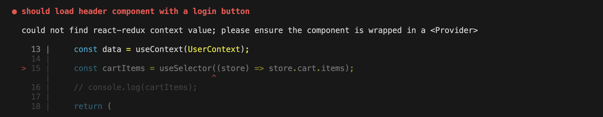

#### Why?

- The `Header` component uses `useSelector()` from Redux.
- We are testing the component **in isolation**.
- JSDOM understands React and JS.
- But it does **not automatically provide Redux context**.

Since `useSelector()` requires a Redux store from `Provider`, the test fails.

### Fix 1: Provide Redux Store

We must wrap the component with Redux `Provider`.

```js
import { render } from "@testing-library/react";
import Header from "../Header";
import { Provider } from "react-redux";
import appStore from "../../utils/appStore";

it("should load header component with a login button", () => {
    render(
        <Provider store={appStore}>
            <Header />
        </Provider>,
    );
});
```

- Again run the testcase, it will fail:

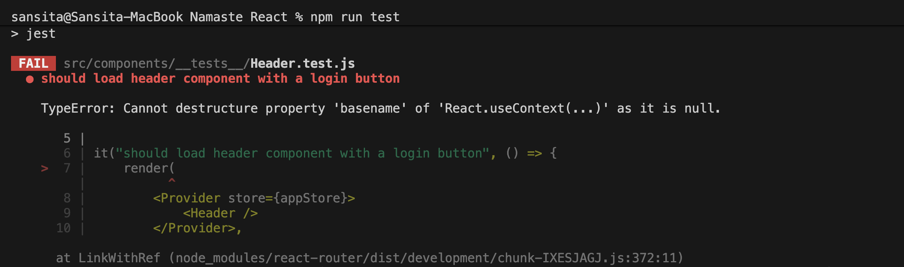

- Our `Header` component uses React Router (e.g., `Link`), so it fails again.
- This happens because Router context is also missing.

### Fix 2: Provide Router Context

Wrap it with `BrowserRouter`:

```js
import { render } from "@testing-library/react";
import Header from "../Header";
import { Provider } from "react-redux";
import appStore from "../../utils/appStore";
import { BrowserRouter } from "react-router-dom";

it("should load header component with a login button", () => {
    render(
        <BrowserRouter>
            <Provider store={appStore}>
                <Header />
            </Provider>
        </BrowserRouter>,
    );
});
```

Now the `Header` component renders successfully.

### Add Assertion

```js
import { render, screen } from "@testing-library/react";
import Header from "../Header";
import { Provider } from "react-redux";
import appStore from "../../utils/appStore";
import { BrowserRouter } from "react-router-dom";
import "@testing-library/jest-dom";

it("should render header component with a login button", () => {
    render(
        <BrowserRouter>
            <Provider store={appStore}>
                <Header />
            </Provider>
        </BrowserRouter>,
    );

    // const loginButton = screen.getByText("Login");
    const loginButton = screen.getByRole("button"); // Better way to find

    expect(loginButton).toBeInTheDocument();
});
```

If multiple buttons exist, use the `name` option:

```js
const loginButton = screen.getByRole("button", { name: "Login" });
```

This is more specific and recommended.

## Testing Cart with 0 Items

```js
it("should render header component with cart items 0", () => {
    render(
        <BrowserRouter>
            <Provider store={appStore}>
                <Header />
            </Provider>
        </BrowserRouter>,
    );

    const cartItems = screen.getByText("0 Item");

    expect(cartItems).toBeInTheDocument();
});
```

### Using Regex (Better Approach)

Instead of matching exact text:

```js
const cartItems = screen.getByText(/Item/);
expect(cartItems).toBeInTheDocument();
```

- This makes the test less fragile.
- It matches any text containing "Item".

We can also make it case-insensitive:

```js
screen.getByText(/item/i);
```

## Testing Login → Logout Functionality

We want to test:

Login → Click → Logout

### Steps

1. Render the component
2. Find the Login button
3. Simulate click
4. Find the Logout button
5. Assert

### Example

```js
import { fireEvent, render, screen } from "@testing-library/react";
import Header from "../Header";
import { Provider } from "react-redux";
import appStore from "../../utils/appStore";
import { BrowserRouter } from "react-router-dom";
import "@testing-library/jest-dom";

it("should change login button to logout on click", () => {
    render(
        <BrowserRouter>
            <Provider store={appStore}>
                <Header />
            </Provider>
        </BrowserRouter>,
    );

    const loginButton = screen.getByRole("button", { name: "Login" });

    fireEvent.click(loginButton);

    const logoutButton = screen.getByRole("button", { name: "Logout" });

    expect(logoutButton).toBeInTheDocument();
});
```

### About `fireEvent`

- `fireEvent` is used to simulate DOM events.
- Examples:
    - `fireEvent.click()`
    - `fireEvent.change()`
    - `fireEvent.submit()`

```js
const loginButton = screen.getByRole("button");
fireEvent.click(loginButton);
```

- This fires the 'click' event for the `loginButton`.

# Test Restaurant Card Component

- `RestaurantCard` component receives **props**.
- So, while rendering it in JSDOM, we must pass mock data as props.
- For that, we create mock data.

## Create Mock Data

- Added an object inside `resCardMock.json` in the `mocks` folder.
- Import and pass it while rendering.

```js
import { screen, render } from "@testing-library/react";
import RestaurantCard from "../RestaurantCard";
import MOCK_DATA from "../mocks/resCardMock.json";
import "@testing-library/jest-dom";

it("should render restaurant card component with props data", () => {
    render(<RestaurantCard restaurantData={MOCK_DATA} />);

    const restaurantName = screen.getByRole("heading", { name: "Pizza Hut" });

    expect(restaurantName).toBeInTheDocument();
});
```

We are checking whether the restaurant name passed via props is rendered.

## Restaurant Card with Open Label (HOC Testing)

If `RestaurantCard` is wrapped with a HOC like `withOpenLabel`:

```js
it("should render restaurant card component with open label", () => {
    const RestaurantCardOpen = withOpenLabel(RestaurantCard);

    render(<RestaurantCardOpen restaurantData={MOCK_DATA} />);

    const openLabel = screen.getByText("Open");

    expect(openLabel).toBeInTheDocument();
});
```

Here, we are testing:

- The original component
- Plus the behavior added by the HOC

That's all about Unit Testing.

# System Testing

## Test Search Functionality

### Flow

1. App loads → renders multiple restaurant cards
2. User types `"Burger"` in search input
3. Cards get filtered
4. Only matching restaurants are shown

Since multiple components work together, this is **System / Integration Testing**.

### Step 1: Render `Body` Component

```js
import { render, screen } from "@testing-library/react";
import Body from "../Body";

it("should search restaurant list for burger text input", () => {
    render(<Body />);
});
```

But this will fail:

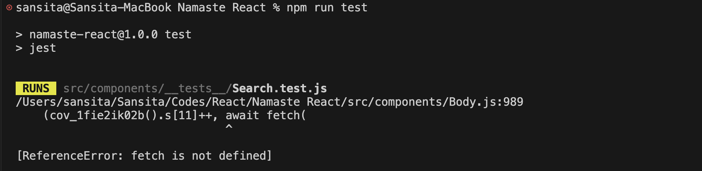

#### Why Does It Fail?

- `render()` renders into JSDOM (not a real browser).
- JSDOM is browser-like, but not a full browser.
- `fetch()` is a Web API (browser feature), not pure JavaScript.
- Jest/JSDOM cannot perform real network requests or `fetch()`.

So we must **mock fetch**.

### Mocking `fetch()`

We override the global `fetch` function using `jest.fn()`.

```js
import MOCK_DATA from "../mocks/mockResListData.json";

// Defining our own fetch():

global.fetch = jest.fn(() => {
    // Here, we will mock it exactly the way our fetch() function works.

    return Promise.resolve({
        json: () => {
            return Promise.resolve(MOCK_DATA);
        },
    });
});
```

#### Why This Structure?

Because:

- `fetch()` returns a Promise.
- That Promise resolves to a Response object that has a `json()`.
- `response.json()` also returns a Promise.
- That Promise resolves with the actual data.

So we replicate the same structure in our mock.

#### Watch Mode (Optional but Useful)

Add this to `package.json`:

```json
"watch-test": "jest --watch"
```

Now run:

```bash
npm run watch-test
```

This automatically re-runs tests on file changes (similar to HMR in React).

### Warning: State Updates Not Wrapped in `act()`

Now, we have rendered the `Body` component, but we may see a warning:

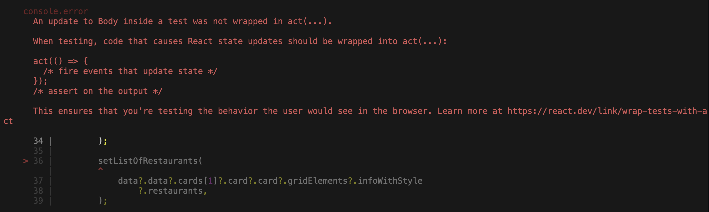

> Warning: An update to Body inside a test was not wrapped in act(...)

This happens because:

- When the component fetches data,
- It updates state asynchronously,
- React expects that to be wrapped inside `act()` during tests.

#### Using `act()`

```js
import { act } from "react";
```

- `act()` ensures all state updates are processed before assertions.
- It returns a Promise → so we use `await` → make the testcase callback async.
- `act()` takes an async function which renders our component.

### Updated Code with `act()`

```js
import { render } from "@testing-library/react";
import Body from "../Body";
import MOCK_DATA from "../mocks/mockResListData.json";
import { BrowserRouter } from "react-router-dom";
import { act } from "react";

global.fetch = jest.fn(() =>
   return Promise.resolve({
        json: () => {
            return Promise.resolve(MOCK_DATA);
        },
    });
);

it("should search restaurant list for burger text input", async () => {
    await act(async () => {
        render(
            <BrowserRouter>
                <Body />
            </BrowserRouter>,
        );
    });
});
```

### Step 2: Find Search Button

```js
const searchBtn = screen.getByRole("button", { name: "search" });

expect(searchBtn).toBeInTheDocument();
```

### Step 3: Simulate Typing and Click

Typing in input triggers `onChange`.

If we are not able to find a component, we can use `data-testid` to find it:

```js
<input data-testid="searchInput" />
```

Then:

```js
const searchInput = screen.getByTestId("searchInput");
```

#### Simulate Typing

```js
fireEvent.change(searchInput, { target: { value: "burger" } });
```

This simulates:

```js
onChange={(event) => setSearchText(event.target.value)}
```

- The object passed to `fireEvent.change()` simulates what we normally receive inside the `event` parameter of the `onChange` handler in the `Body` component:

```js
<input
    type="text"
    className="border-0 outline-0 w-full"
    placeholder="Search for restaurants"
    value={searchText}
    onChange={(event) => setSearchText(event.target.value)}
    data-testid="searchInput"
></input>
```

- In a real browser environment, `event` and `event.target.value` are automatically provided by the browser.
- However, in **jsdom**, we simulate (mock) this behavior manually.
- Since there is no real browser during testing, we have to fake the `event` object ourselves.

#### Simulate Button Click

```js
fireEvent.click(searchBtn);
```

#### Final Assertion

If searching "burger" should return only 1 card:

```js
const resCards = screen.getAllByTestId("restaurantCard");
expect(resCards.length).toBe(1);
```

### Final Test Case

```js
import { fireEvent, render, screen } from "@testing-library/react";
import Body from "../Body";
import MOCK_DATA from "../mocks/mockResListData.json";
import { BrowserRouter } from "react-router-dom";
import { act } from "react";
import "@testing-library/jest-dom";

global.fetch = jest.fn(() =>
    Promise.resolve({
        json: () => Promise.resolve(MOCK_DATA),
    }),
);

it("should search restaurant list for burger text input", async () => {
    await act(async () => {
        render(
            <BrowserRouter>
                <Body />
            </BrowserRouter>,
        );
    });

    const searchBtn = screen.getByRole("button", { name: "search" });
    const searchInput = screen.getByTestId("searchInput");

    fireEvent.change(searchInput, { target: { value: "burger" } });
    fireEvent.click(searchBtn);

    const resCards = screen.getAllByTestId("restaurantCard");

    expect(resCards.length).toBe(1);
});
```

### Test: Cards Before and After Search

```js
import { fireEvent, render, screen } from "@testing-library/react";
import Body from "../Body";
import MOCK_DATA from "../mocks/mockResListData.json";
import { BrowserRouter } from "react-router-dom";
import { act } from "react";
import "@testing-library/jest-dom";

// Mocking global fetch()
global.fetch = jest.fn(() => {
    return Promise.resolve({
        json: () => Promise.resolve(MOCK_DATA),
    });
});

it("should search restaurant list for burger text input", async () => {
    await act(async () => {
        render(
            <BrowserRouter>
                <Body />
            </BrowserRouter>,
        );
    });

    // Before Search
    const cardsBeforeSearch = screen.getAllByTestId("restaurantCard");
    expect(cardsBeforeSearch.length).toBe(20);

    // Perform Search
    const searchBtn = screen.getByRole("button", { name: "search" });
    const searchInput = screen.getByTestId("searchInput");

    fireEvent.change(searchInput, { target: { value: "burger" } });
    fireEvent.click(searchBtn);

    // After Search
    const cardsAfterSearch = screen.getAllByTestId("restaurantCard");
    expect(cardsAfterSearch.length).toBe(1);
});
```

**Here, we:**

1. Render the `Body` component.
2. Assert the initial number of restaurant cards.
3. Simulate typing `"burger"` into the search input.
4. Click the search button.
5. Assert the filtered result count.

## Test: Top Rated Restaurants Filter

```js
it("should filter top rated restaurants", async () => {
    await act(async () => {
        render(
            <BrowserRouter>
                <Body />
            </BrowserRouter>,
        );
    });

    // Before Filter
    const cardsBeforeFilter = screen.getAllByTestId("restaurantCard");
    expect(cardsBeforeFilter.length).toBe(20);

    // Click Filter Button
    const topRatedResBtn = screen.getByRole("button", {
        name: "Top Rated Restaurants",
    });

    fireEvent.click(topRatedResBtn);

    // After Filter
    const cardsAfterFilter = screen.getAllByTestId("restaurantCard");
    expect(cardsAfterFilter.length).toBe(18);
});
```

## Test: Add to Cart Feature

When clicking the **Add** button, two things should happen:

1. The cart count in the **Header** updates.
2. The **Cart component** updates.

### 1. Render Restaurant Menu

```js
import { render } from "@testing-library/react";
import RestaurantMenu from "../RestaurantMenu";
import { act } from "react";
import MOCK_DATA from "../mocks/mockResMenu.json";
import { Provider } from "react-redux";
import appStore from "../../utils/appStore";

global.fetch = jest.fn(() => {
    return Promise.resolve({
        json: () => Promise.resolve(MOCK_DATA),
    });
});

it("should load restaurant menu component", async () => {
    await act(async () => {
        render(
            <Provider store={appStore}>
                <RestaurantMenu />
            </Provider>,
        );
    });
});
```

### 2. Click the Add Button

```js
const addBtns = screen.getAllByRole("button", { name: "add" });
fireEvent.click(addBtns[0]);
```

### 3. Test Header Update

- Initially, only the `RestaurantMenu` is rendered in JSDOM - not the `Header`.

- So we must render the `Header` as well:

```js
await act(async () => {
    render(
        <BrowserRouter>
            <Provider store={appStore}>
                <Header />
                <RestaurantMenu />
            </Provider>
        </BrowserRouter>,
    );
});
```

Now we can assert:

```js
expect(screen.getByText("1 Item")).toBeInTheDocument();
```

### 4. Test Cart Component Update

- Render the `Cart` component.
- Get cart items.
- Assert their length.

```js
it("should update cart component", async () => {
    await renderComponent();

    const cartSection = screen
        .getByText("My Cart")
        .closest("div")?.parentElement;

    const cartItems = within(cartSection).getAllByTestId("cartItems");

    expect(cartItems.length).toBe(2);
});
```

#### Explanation

1. `screen.getByText("My Cart")`

    Finds the element that contains the text `"My Cart"`.

2. `.closest("div")?.parentElement`

    Moves up the DOM to get the full cart container element.

3. `within(cartSection).getAllByTestId("cartItems")`

    Searches only inside the cart section for elements with `data-testid="cartItems"`.

4. `expect(cartItems.length).toBe(2);`

    Verifies that exactly 2 cart items are rendered.

### Final Code

```js
import { fireEvent, render, screen, within } from "@testing-library/react";
import RestaurantMenu from "../RestaurantMenu";
import Header from "../Header";
import { act } from "react";
import MOCK_DATA from "../mocks/mockResMenu.json";
import { Provider } from "react-redux";
import appStore from "../../utils/appStore";
import { BrowserRouter } from "react-router";
import "@testing-library/jest-dom";
import Cart from "../Cart";

global.fetch = jest.fn(() => {
    return Promise.resolve({
        json: () => Promise.resolve(MOCK_DATA),
    });
});

const renderComponent = async () => {
    await act(async () => {
        render(
            <BrowserRouter>
                <Provider store={appStore}>
                    <Header />
                    <RestaurantMenu />
                    <Cart />
                </Provider>
            </BrowserRouter>,
        );
    });
};

it("should show 0 items initially", async () => {
    await renderComponent();
    expect(screen.getByText("0 Item")).toBeInTheDocument();
});

it("should update to 1 item after clicking Add once", async () => {
    await renderComponent();

    const addBtns = screen.getAllByRole("button", { name: "add" });
    fireEvent.click(addBtns[0]);

    expect(screen.getByText("1 Item")).toBeInTheDocument();
});

it("should update to 2 items after clicking Add twice", async () => {
    await renderComponent();

    const addBtns = screen.getAllByRole("button", { name: "add" });
    fireEvent.click(addBtns[1]);

    expect(screen.getByText("2 Items")).toBeInTheDocument();
});

it("should update cart component", async () => {
    await renderComponent();

    const cartSection = screen
        .getByText("My Cart")
        .closest("div")?.parentElement;

    const cartItems = within(cartSection).getAllByTestId("cartItems");

    expect(cartItems.length).toBe(2);
});
```

## Test: Clear Cart Feature

```js
it("should clear the cart component", async () => {
    await renderComponent();

    const clearBtn = screen.getByText("Clear Cart");

    fireEvent.click(clearBtn);

    expect(screen.getByText("0 Item")).toBeInTheDocument();
    expect(screen.getByText("Cart is Empty!")).toBeInTheDocument();
});
```

# Some Functions (Jest Lifecycle Methods)

## 1. `beforeAll()`

- Suppose we have a `describe` block and we need to execute something before running all the tests inside it.
- Jest provides a special function for this purpose called `beforeAll()`.
- It takes a callback function that runs once before all the test cases in that block.

This is useful for:

- Setting up shared data
- Initializing resources
- Performing one-time setup logic

## 2. `beforeEach()`

- The callback inside `beforeEach()` runs before every individual test.
- This is very helpful for resetting state or doing cleanup/setup before each test runs.

- Jest (along with Testing Library) provides access to these lifecycle methods.

## 3. `afterAll()`

- `afterAll()` runs once after all the tests inside the `describe` block have completed.
- It is typically used for cleanup tasks that should run only once.

## 4. `afterEach()`

- The callback inside `afterEach()` runs after every individual test.
- It is commonly used for:
    - Clearing mocks
    - Resetting DOM
    - Cleaning up side effects

### Example

```js
describe("Contact Us page test cases", () => {
    beforeAll(() => {
        console.log("Before All");
    });

    beforeEach(() => {
        console.log("Before Each");
    });

    afterAll(() => {
        console.log("After All");
    });

    afterEach(() => {
        console.log("After Each");
    });

    // Test Cases
});
```

**Output:**

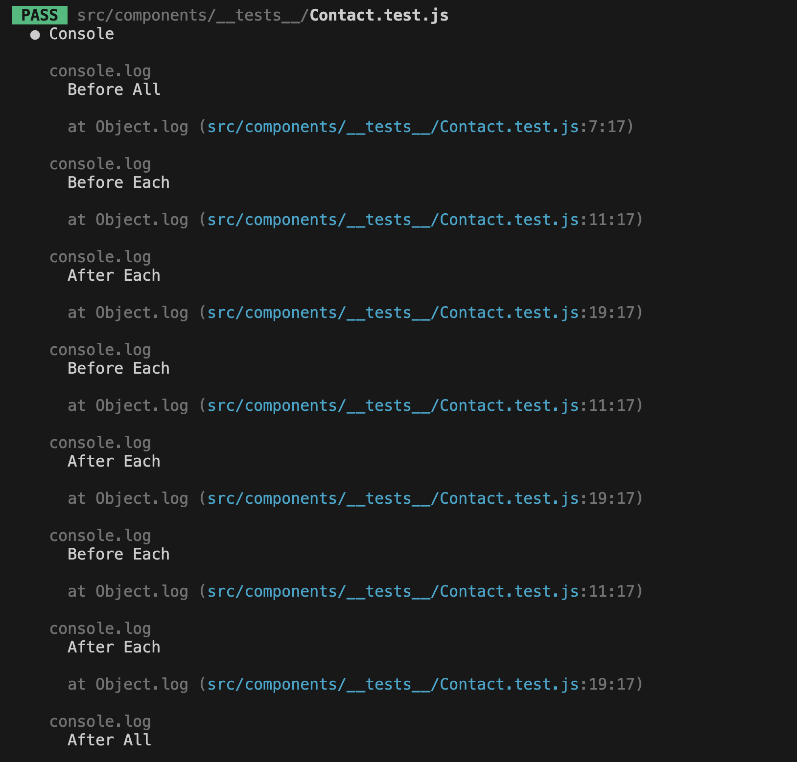

## Coverage Report

- After running tests with coverage enabled, Jest generates a `coverage` folder.
- Inside `coverage/lcov-report`, the `index.html` file shows the detailed coverage report.
- Opening that file in a browser lets us:
    - See which files are covered
    - Identify uncovered lines

This helps us understand what parts of our application are not being tested.
