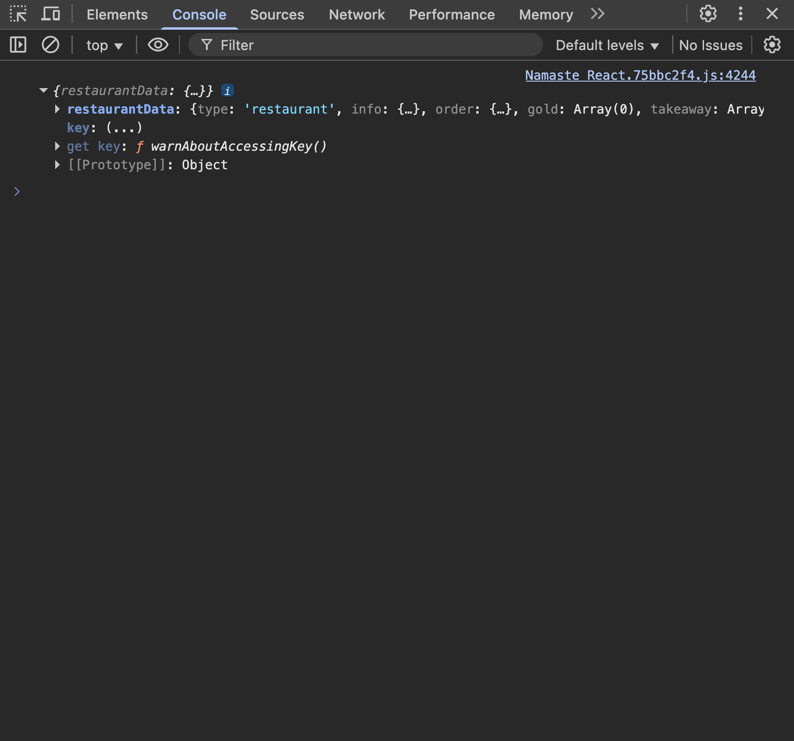

# Building a Food Ordering App

## 1. Plan the UI (Wireframe / Mockup)

**Header**

-   Logo
-   Navigation Items

**Body**

-   Search Bar
-   RestaurantContainer

    -   RestaurantCard

**Footer**

-   Copyright
-   Links
-   Address
-   Contact Information

## 2. Code the Plan

### Props

**Current Code:**

```js
const RestaurantCard = () => {
    return (
        <div className="restaurant-card">
            <div className="card-image">
                
            </div>

            <div className="card-content">
                <h3 className="card-heading">SpiceVilla Cafe</h3>
                <p>Pav Bhaji, North Indian, Asian</p>
                <div className="dish-details">
                    <span>
                        4.3
                        <i className="bi bi-star-fill"></i>
                    </span>
                    <span>
                        30 mins
                        <i className="bi bi-clock"></i>
                    </span>
                    <span>₹200 for 2</span>
                </div>
            </div>
        </div>
    );
};
```

Here, the restaurant name and details are hardcoded, making this component **non-reusable**.
To make it reusable, we can use **props**.

### What are Props?

-   “Props” is short for **properties**.
-   We can pass props to a component to provide data dynamically.
-   Essentially, passing props to a component is like passing arguments to a function.

### Passing Props

```js
<RestaurantCard
    restaurantName="SpiceVilla Cafe"
    cuisine="Pav Bhaji, North Indian, Asian"
/>
```

-   This is called passing props to a functional component.
-   When we pass props like this, React automatically bundles them into an **object** and passes that object to the component.

```js
const RestaurantCard = (props) => {
    console.log(props);
};
```



Here, `props` is an **object** containing all passed properties.

### Accessing Props

```js
const RestaurantCard = (props) => {
    return (
        <div className="restaurant-card">
            <div className="card-content">
                <h3 className="card-heading">{props.restaurantName}</h3>
                <p>{props.cuisine}</p>
            </div>
        </div>
    );
};
```

**OR (using destructuring):**

```js
const RestaurantCard = ({ restaurantName, cuisine }) => {
    return (
        <div className="restaurant-card">
            <div className="card-content">
                <h3 className="card-heading">{restaurantName}</h3>
                <p>{cuisine}</p>
            </div>
        </div>
    );
};
```

## Config-Driven UI

-   A **config-driven UI** means the structure and content of the UI are controlled by **data** (usually from the backend).
-   So, our website is driven by data or configs.

-   This allows us to build dynamic UIs that update automatically when data changes.

For example:

-   The carousel on a website may display different images or offers depending on the user’s location.
-   This happens because the UI is powered by the data or configuration sent from the backend.

So, a **frontend application** can be represented as:

> **Frontend App = UI Layer + Data Layer**

Note: Swiggy uses **Cloudinary** (a CDN) to host its images efficiently.

## Best Practices

### 1. Destructure Objects

Always destructure objects for cleaner and more readable code.

```js
const { image, name, cuisine, rating, cfo } = restaurantData.info;
const { deliveryTime } = restaurantData.order;
```

### 2. Use `map()` for Rendering Lists

```js
const Body = () => {
    return (
        <div className="body">
            <div className="search"></div>
            <div className="restaurant-container">
                {restaurants.map((restaurant) => (
                    <RestaurantCard
                        key={restaurant.info.id}
                        restaurantData={restaurant}
                    />
                ))}
            </div>
        </div>
    );
};
```

If we don’t provide a `key` prop, React will warn us:

`Each child in a list should have a unique "key" prop.`

### Why Do We Need a `key`?

-   Components rendered at the same level must have **unique identifiers** so React can efficiently update them.
-   If a new restaurant is added at the top, React needs to know which components are new and which already exist.

-   Without unique keys, React would re-render the **entire list**, even if only one item changed.
-   This is b/z it will never know which card is new and which is old, it will treat all cards as same.
-   It will just clean the entire container and then re-render all cards.

When keys are unique:

-   React will know that these ids are already existing ids and other ids are new ids.
-   It only re-renders the new or modified components, improving performance.

That's why, whenever we loop on a list, we need to add a key property for each item.

### Choosing a Key

-   Using the **index** of an array as a key may seem convenient, but it’s not reliable.
-   If the list changes (items added, removed, or reordered), React may misinterpret the changes.

> From [React Docs](https://react.dev/learn/rendering-lists#why-does-react-need-keys):
> “You might be tempted to use an item’s index in the array as its key. In fact, that’s what React will use if you don’t specify a key at all. But the order in which you render items will change over time if an item is inserted, deleted, or if the array gets reordered. Index as a key often leads to subtle and confusing bugs.”

**not using keys (not acceptable) <<< index as key <<<<<<<<<< unique id (best practice)**
