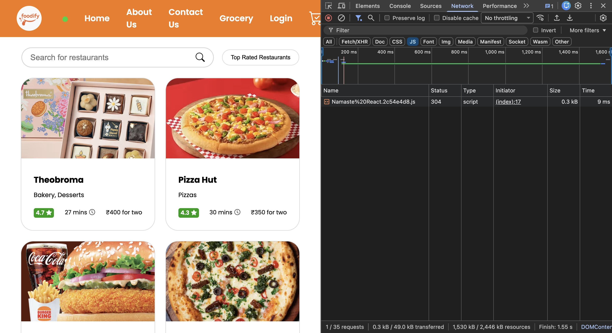
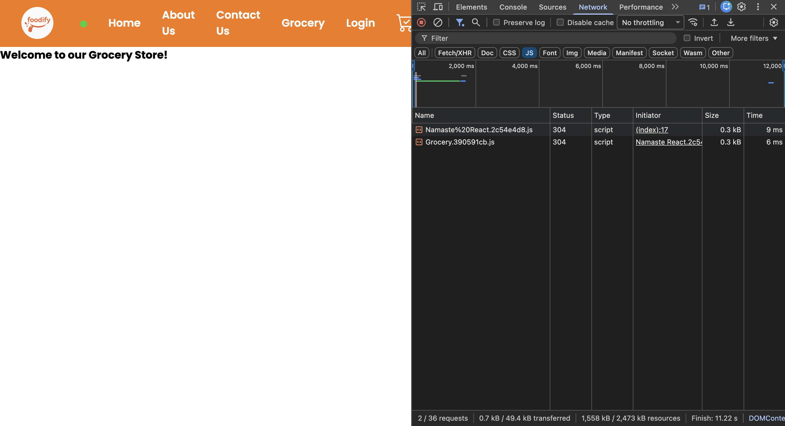
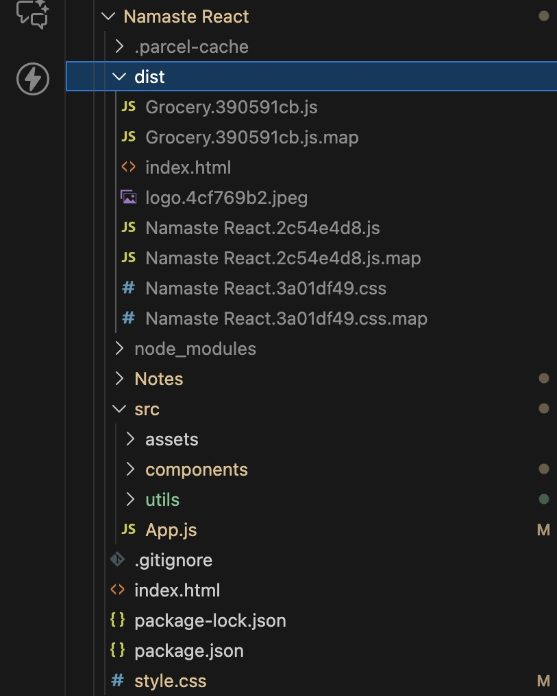

# Custom Hooks

## Single Responsibility Principle

-   Any single entity in our code (a function or a class) should have **only one responsibility**.

-   In a React app, every component (or function) should focus on doing **one thing well**.

-   If a component is handling multiple responsibilities, we should break it down into multiple smaller components.

-   **Example:**
    If we have a `RestaurantCard` component, its only responsibility should be to display a restaurant card.

### Breaking down our code into small pieces:

-   Makes the code easier to test
-   Makes debugging simpler
-   Makes the code reusable → Wherever we need to display a restaurant card, we can reuse the `RestaurantCard` component without rewriting its logic.

**Keeping our code modular makes it testable, maintainable, and reusable.**

> **NOTE:**
> This principle does not have strict rules. The goal is simply to make components as light and focused as possible.

Custom Hooks help us apply this principle effectively.

## Use of Custom Hooks

-   Hooks are just **utility functions**.
-   We extract logic from components and move it into hooks so that both:

    -   the component
    -   and the hook
        become more **modular** and **readable**.

> Creating a custom hook is not mandatory, but it is considered a good practice because it improves readability, reusability, and maintainability.

### Why do we need a Custom Hook inside `RestaurantMenu`?

The `RestaurantMenu` component has **two major responsibilities**:

1. Fetching the data
2. Displaying the data

-   Ideally, `RestaurantMenu` should only be responsible for **displaying data**.

-   It should not worry about:

    -   where the data comes from
    -   which API is used
    -   how the fetching is done

-   So, we move all fetching logic into a custom hook.

```js
const { resId } = useParams();
const resInfo = useRestaurantMenu(resId);
```

## Creating a Custom Hook

-   We usually create custom hooks inside a `utils` or `hooks` folder since hooks are utility/helper functions.
-   Good convention: One file per hook.
-   Hooks must start with `"use"` because React identifies functions that start with `use` as hooks.

### Contract (Input + Output) of the hook:

```js
const useRestaurantMenu = (resId) => {
    // fetch data

    return resInfo;
};
```

-   Fetching data inside a hook is no different than fetching inside a component.
-   Hooks can have:

    -   state
    -   effects
    -   lifecycle logic

Just like components.

### Hook Implementation

```js
import { useEffect, useState } from "react";
import { MENU_API } from "../utils/constants";

const useRestaurantMenu = (resId) => {
    const [menuItems, setMenuItems] = useState([]);
    const [resInfo, setResInfo] = useState({});

    useEffect(() => {
        fetchData();
    }, []);

    const fetchData = async () => {
        const response = await fetch(MENU_API + resId);
        const data = await response.json();

        let arr = [];

        // Extract menu items from API structure
        arr = data?.data?.cards[4]?.groupedCard?.cardGroupMap?.REGULAR.cards;

        // Filter and extract itemCards
        arr = arr
            ?.filter((item, index) => index !== 0 && index !== 1)
            ?.map((item) => item?.card?.card?.itemCards)
            ?.filter(Boolean)
            ?.flat();

        /*
        arr structure:
        [
            [item1, item2],
            [item3, item4],
            ...
        ]
        */

        // Remove duplicates
        let uniqueMenuItems = [];

        arr.forEach((item) => {
            if (
                !uniqueMenuItems.find(
                    (x) => x?.card?.info?.id === item?.card?.info?.id
                )
            ) {
                uniqueMenuItems.push(item);
            }
        });

        setMenuItems(uniqueMenuItems);

        // Set restaurant info
        setResInfo(data?.data?.cards[2]?.card?.card?.info);
    };

    return [menuItems, resInfo];
};

export default useRestaurantMenu;
```

### Usage inside `RestaurantMenu` component:

```js
const { resId } = useParams();
const [menuItems, resInfo] = useRestaurantMenu(resId);

if (menuItems.length === 0) return <Shimmer />;
```

-   This is now testable.
-   The fetching logic can be tested independently from the UI using the `useRestaurantMenu` hook.

## Implementing Online / Offline Feature

-   If the user is offline, we can display a message instead of showing a broken UI.

### 1. Contract

```js
const useOnlineStatus = () => {
    // Check if online

    return onlineStatus;
};
```

-   This hook does not require any input.
-   It returns a boolean:

```
true  → online
false → offline
```

> **Caller**: The component which will call this hook.

### 2. Checking Online Status

-   To check user's online status, we use browser-provided event listeners.
-   These listeners track if the device goes online or offline.
-   They are provided through the `window` object.

```js
import { useEffect, useState } from "react";

const useOnlineStatus = () => {
    const [onlineStatus, setOnlineStatus] = useState(navigator.onLine);

    // Check if offline
    useEffect(() => {
        window.addEventListener("offline", () => {
            setOnlineStatus(false);
        });

        window.addEventListener("online", () => {
            setOnlineStatus(true);
        });
    }, []);

    // Boolean Value
    return onlineStatus;
};

export default useOnlineStatus;
```

> Go to: [online_event](https://developer.mozilla.org/en-US/docs/Web/API/Window/online_event)

-   We want to register these event listeners only **once** when the component mounts.
-   That’s why we write this logic inside `useEffect()` with an **empty dependency array (`[]`)**, so the effect runs only on the initial render and not on every re-render.

> The `onLine` property of the `Navigator` interface returns whether the device is connected to the network, with true meaning online and false meaning offline

### Usage:

```js
const onlineStatus = useOnlineStatus();

if (!onlineStatus)
    return <h1>Looks like you're offline! Please check your connection.</h1>;
```

## Notes on Naming Hooks

-   Naming a hook with `"use"` is not technically mandatory.
-   But React strongly recommends it.
-   Linters may throw errors if we don’t follow this rule.
-   Just like naming React components with a capital letter is not technically compulsory, but it is a widely followed convention.
-   Similarly, prefixing a function with `"use"` makes the code more readable and clearly indicates that the function is a custom hook, not a normal JS function.

# Parcel

## What is Parcel?

Parcel is a **bundler**.

A bundler’s core responsibility is:

> Taking multiple files and bundling them into fewer files (often one or a few optimized files).

## What does bundling mean?

Bundling means:

> Parcel takes all our project files and bundles them into a single JavaScript file.

If we open the `dist` folder after a build, we will often see:

-   One main JavaScript file (the app bundle)
-   Source map files (`.map`)

### Important points:

-   In **development mode**, the JavaScript file is:

    -   Not minified
    -   Not compressed

-   In **production build**, the JavaScript file is:

    -   Minified
    -   Compressed
    -   Function and variable names may be renamed
    -   The file size is significantly reduced

Even in production, the output is often **one main JS file**.

So:

-   Only one main JS file is loaded
-   All page logic (Home, About, Contact, etc.) comes from the same file

> Everything on our website runs from a **single JavaScript file**.

## Should we bundle everything into one JS file?

### Pros:

-   No multiple HTTP calls
-   Simpler loading
-   Faster for small apps

### Problem:

When a website grows large, the bundle size increases a lot.

Example:
A large website like **MakeMyTrip** includes:

-   Flights
-   Hotels
-   Homestays
-   Trains
-   Buses
-   Holiday packages

Each of these sections contains:

-   Hundreds of components
-   Thousands of lines of code

If everything is bundled into one file:

-   That JS file becomes very large (2MB or more in development builds)
-   Initial load time increases
-   Performance degrades
-   Users wait longer before seeing any content

### Why not avoid bundling completely?

Loading thousands of individual JS files:

-   Creates thousands of HTTP requests
-   Is extremely slow for browsers
-   Is inefficient and unscalable

So:

-   One giant file is bad
-   Thousands of small files is worse
-   We need a **balanced solution**

## Solution: Logical Bundling

-   Instead of **one huge bundle**, we create **multiple smaller bundles**.
-   Each bundle represents a **logical feature** of the application.

## Names used for the same concept

All of the terms below mean the same core idea:

-   Chunking
-   Code splitting
-   Dynamic bundling
-   Lazy loading
-   On-demand loading
-   Dynamic imports

All these words point to:

> Splitting the app into smaller logical chunks and loading them only when required.

## How to design bundles logically?

-   Bundles should be based on **features**, not files.
-   A bundle should have enough code for a major feature of the website.

Example: MakeMyTrip bundles:

-   Flight module → one bundle
-   Hotel module → one bundle
-   Homestays module → one bundle
-   Train booking → one bundle

Each bundle contains:

-   Its own UI components
-   Its own logic
-   All related subcomponents

This is known as **Feature-based bundling**.

Large websites are effectively:

> Multiple mini-applications inside a larger application

## Practical example: Grocery module inside a Food App

Assume initially our app only handles:

-   Food delivery

Later we add:

-   Grocery delivery (like Swiggy Instamart)

Now we have:

-   Food delivery logic
-   Grocery delivery logic

Each has:

-   Home page
-   Menu
-   Cart
-   Order system
-   Subcomponents

These should not be tightly bundled together.

### Problem without splitting

If Grocery is imported normally:

```js
import Grocery from "./components/Grocery";
```

Then:

-   Grocery code is bundled into the main file
-   It loads even if user never opens Grocery
-   Bundle size increases unnecessarily

### Goal

We want:

-   Grocery code to load ONLY when user visits `/grocery`
-   Main bundle to remain small
-   Faster first load
-   Better performance

# Lazy Loading in React

Instead of normal import:

```js
import Grocery from "./components/Grocery";
```

We use:

```js
const Grocery = React.lazy(() => import("./components/Grocery"));
```

Now:

-   This import is evaluated only when needed
-   Code does not load during initial page load
-   Grocery is bundled into a separate chunk
-   Main bundle becomes smaller
-   Performance improves

## How `lazy()` works

`lazy()` takes a **callback function**.

Inside that function, we use:

```js
import(...)
```

This `import`:

-   Is NOT the same as a normal ES import statement
-   Is called a **dynamic import**
-   Returns a Promise
-   Takes the path of `Grocery` component
-   Performs a dynamic import
-   Loads code asynchronously
-   Creates a new JavaScript bundle (chunk)

> Reference: [import()](https://developer.mozilla.org/en-US/docs/Web/JavaScript/Reference/Operators/import)
>
> The `import()` syntax, commonly called **dynamic import**, is a function-like expression that allows loading an ECMAScript module asynchronously and dynamically into a potentially non-module environment.  
> The `import()` call is a syntax that closely resembles a function call, but `import` itself is a keyword, not a function.

## Why this one line is powerful

This single line:

```js
const Grocery = lazy(() => import("./components/Grocery"));
```

Does the following:

-   Removes Grocery from main bundle
-   Creates a separate grocery bundle
-   Loads Grocery dynamically
-   Optimizes performance
-   Enables code splitting
-   Reduces initial payload

Now, with this code, we have splitted our code into 2 JS bundles.

### Why is it called Lazy Loading?

Because:

-   Code is delayed
-   Only loaded when requested
-   App does not load everything at once

## Verifying bundle splitting in browser

When page first loads:

-   Only one JS file is shown
-   Grocery bundle is NOT present



When user visits `/grocery`:

-   A new JS file appears
-   This is the dynamically loaded chunk
-   Grocery bundle loads separately



Now:

-   `dist/` folder will contain a new JS file
-   That file contains Grocery code only



## Why error appears when only using lazy

Error message:

> A component suspended while responding to synchronous input.

**Explanation**:

1. App loads home page
2. Only one JS file is loaded
3. Grocery code is not downloaded initially
4. User clicks on Grocery
5. React immediately tries to render Grocery
6. Bundle is still downloading, it took some time to fetch the data of Grocery
7. Grocery component is undefined temporarily
8. React cannot render null code
9. React throws an error and suspends

Reason:

> React is too fast - the code has not arrived yet.

## NOTE (Updated Behavior)

Earlier, React often threw errors if `Suspense` was missing.
In modern React, our app may not crash - but users may see **blank screens or no loading feedback**.

So while `Suspense` is no longer just for avoiding errors, it is still **important for good UX**:

-   Displays fallback UI while loading
-   Prevents white screens
-   Improves perceived performance

> `Suspense` is now mainly for user experience, not just error handling.

## `Suspense`

To handle the delay, React provides the `Suspense` component:

```js
import { Suspense } from "react";
```

## What is `Suspense`?

`Suspense` is a React component that:

-   Handles waiting state
-   Displays fallback UI or placeholder UI
-   Prevents rendering errors
-   Waits for lazy-loaded code

## How to use `Suspense`

Wrap lazy component inside `Suspense`:

```js
<Suspense fallback={<h1>Loading...</h1>}>
    <Grocery />
</Suspense>
```

### What is `fallback`?

`fallback` is:

-   A placeholder UI
-   Displayed while bundle loads
-   Can be JSX
-   Can be a loader
-   Can be shimmer UI

Examples:

```js
fallback={<h1>Loading...</h1>}
```

or

```js
fallback={<ShimmerUI />}
```

## What happens after adding `Suspense`

Now the flow becomes:

1. Page loads
2. Grocery not loaded
3. User clicks Grocery
4. React shows fallback UI
5. Grocery bundle downloads
6. Grocery code arrives
7. Component renders
8. User never sees an error

## Final result after lazy + suspense

Now:

-   Home → main bundle
-   Grocery → separate bundle

Each page loads its own JS file.

## Why this matters in production systems

Large apps face:

-   Bundle bloat
-   Performance issues
-   Long load times

This is known as:

> App bloating or  
> Bundle size growth

### When should we use lazy loading?

Do not overuse it for:

-   Small components
-   Tiny pages

If bundle size becomes 10MB+ then:

-   Code splitting is mandatory.
