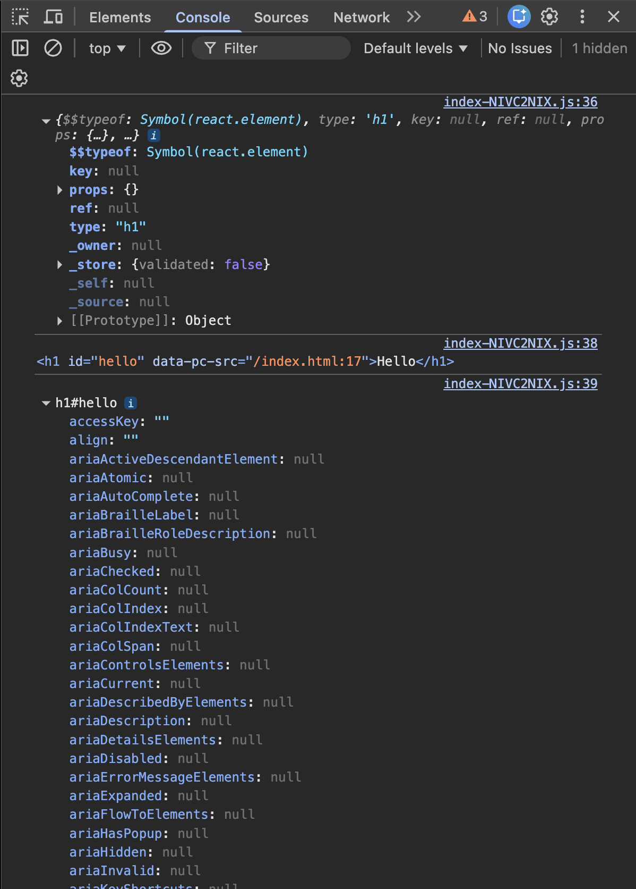

## 1. `onClick = {handleAddItem};`

### What happens

- You are **passing a function reference** to `onClick`.
- React will call `handleAddItem` **only when the click happens**.

### When to use

- When `handleAddItem` **does not need any arguments**.
- This is the **cleanest and most efficient** form.

### Mental model

> “Hey React, call this function later when the click happens.”

## 2. `onClick = {handleAddItem(item)};`

### What happens

- `handleAddItem(item)` is **executed immediately during render**.
- The **return value** of `handleAddItem(item)` is assigned to `onClick`.
- The function **does NOT wait for a click**.

### Why this is wrong (usually)

- React expects a **function**, but here it gets:
    - `undefined`, or
    - whatever `handleAddItem` returns

- Side effects happen **on every render**, not on click.

### Mental model

> “Run this function right now, while rendering.”

## 3. `onClick = {() => handleAddItem(item)};`

### What happens

- You are passing a **new function (callback)** to `onClick`.
- That function **does NOT run immediately**.
- It runs **only when the click happens**, and then calls
  `handleAddItem(item)`.

### When to use

- When you need to pass **arguments** to the handler.
- This is the **correct way** to pass parameters.

### Mental model

> “When clicked, run this wrapper function, which then calls my function with data.”

## Rule to remember

- **No arguments?** → pass function directly

    ```js
    onClick = { handleAddItem };
    ```

- **With arguments?** → wrap in arrow function

    ```js
    onClick={() => handleAddItem(item)}
    ```

# The Process: Reconciliation

When you trigger an update (by calling `setListOfRestaurants`), React starts the **Reconciliation** process.

#### Step A: Render Phase (Creating the Snapshot)

React calls your component function again. It creates a **new** Virtual DOM tree based on the _new_ data you just set.

#### Step B: Diffing (Finding the Difference)

Now React has two versions of the Virtual DOM:

1. **The Old Virtual DOM:** Represents what is currently on the screen.
2. **The New Virtual DOM:** Represents what _should_ be on the screen now.

React compares these two versions using a "Diffing Algorithm." It looks for exactly what changed.

- _Did a `<div>` turn into a `<span>`?_
- _Did the class name change?_
- _Did the text inside a button change from "Login" to "Logout"?_

#### Step C: The Commit (Updating the Real UI)

Once React knows exactly what changed (e.g., only the text of one specific button changed), it touches the **Real DOM**.
It applies **only** those specific changes. It does not touch the header, the footer, or the sidebar if they haven't changed.

---

## 1. “React monitors all variables created using `useState()`”

When you write:

```js
const [listOfRestaurants, setListOfRestaurants] = useState([]);
```

React does **not** treat `listOfRestaurants` like a normal JS variable.

### What makes it special?

- React **remembers** this variable between renders.
- React **tracks** when its value changes.
- React knows **which component** this state belongs to.

Think of `useState` variables as **data React is responsible for**, not just JavaScript data.

> Normal variables → React ignores them
> `useState` variables → React watches them closely

---

## 2. “When the setter function is called (e.g., `setListOfRestaurants`)”

Example:

```js
setListOfRestaurants(newList);
```

This does **not** directly change the UI like `innerHTML` would.

Instead, this is what actually happens:

### Internally, React does:

1. Stores the **new state value**
2. Marks the component as **dirty** (needs update)
3. Schedules a **re-render**

Important:

```js
listOfRestaurants = newList; ❌ (React won’t care)
setListOfRestaurants(newList); ✅ (React reacts)
```

---

## 3. “React triggers the reconciliation process”

### What is reconciliation?

Reconciliation is React’s **comparison algorithm**.

It answers:

> “What changed since the last render, and what actually needs to be updated on the screen?”

Steps:

1. Component function runs again
2. A **new Virtual DOM tree** is created
3. React compares it with the **previous Virtual DOM**

This comparison is called **diffing**.

---

## 4. “It finds the differences between Virtual DOMs”

### Virtual DOM

- A lightweight **JavaScript object representation** of the UI
- Not the real browser DOM

Example:

```js
<h1>Hello</h1>
```

becomes something like:

```js
{
  type: 'h1',
  props: { children: 'Hello' }
}
```

After state change:

```js
<h1>Hello Sansita</h1>
```

React compares:

- Old Virtual DOM
- New Virtual DOM

And figures out:

> “Only the text inside `<h1>` changed.”

---

## 5. “It updates the UI automatically by re-rendering the component”

### Re-render ≠ Reload page

Re-render means:

- React **calls your component function again**
- JSX is re-evaluated
- A new Virtual DOM is created

Example:

```js
function App() {
    const [count, setCount] = useState(0);

    return <h1>{count}</h1>;
}
```

Calling:

```js
setCount(1);
```

React:

- Calls `App()` again
- Produces `<h1>1</h1>`
- Compares with previous `<h1>0</h1>`

---

## 6. “This ensures that the UI always reflects the latest data”

This is called **declarative UI**.

You don’t say:

```js
document.getElementById("count").innerText = count;
```

Instead, you say:

```js
<h1>{count}</h1>
```

Meaning:

> “Whenever `count` changes, show the latest value here.”

React handles _how_ and _when_ to update the DOM.

---

## 7. “React updates only the necessary parts of the UI instead of re-rendering everything”

This is React’s **big performance win**.

### What React does NOT do:

- Remove the whole DOM
- Rebuild everything again

### What React DOES:

- Finds **minimum changes**
- Applies **only those changes** to the real DOM

Example:

```js
<ul>
    <li>A</li>
    <li>B</li>
    <li>C</li>
</ul>
```

If only `B` changes → React updates **only that `<li>`**, not the whole `<ul>`.

This process is called **efficient DOM updates**.

---

## 8. Mental Model (Very Important)

Think of it like this:

```
State change
   ↓
Component re-runs
   ↓
New Virtual DOM
   ↓
Diff with old Virtual DOM
   ↓
Minimal real DOM updates
```

You:

- Change **state**
  React:
- Takes care of **UI synchronization**

In React (and JavaScript), a **React element** and the **object returned from `document.getElementById()`** are completely different things.

Let’s understand them clearly.

# 1️⃣ React Element

A **React element** is a plain JavaScript object that describes what you want to see on the UI.

Example:

```jsx
const element = <h1>Hello Sansita</h1>;
console.log(element);
```

Behind the scenes, this becomes:

```js
{
  type: "h1",
  props: {
    children: "Hello Sansita"
  }
}
```

### 🔹 Key Points

- It is **NOT a real DOM node**.
- It is just a **JavaScript object**.
- React uses it to create/update the **Virtual DOM**.
- Created using:
    - JSX (`<h1>Hello</h1>`)
    - `React.createElement()`

Example without JSX:

```js
const element = React.createElement("h1", {}, "Hello Sansita");
```

So:

> React Element = Blueprint / Description of UI

# 2️⃣ Object Returned from `document.getElementById()`

Example:

```js
const root = document.getElementById("root");
console.log(root);
```

This returns a **real DOM node**.

Example output:

```js
<div id="root"></div>
```

### 🔹 Key Points

- It is an actual **HTML DOM element**.
- Type: `HTMLElement`
- You can directly modify it:

```js
root.innerHTML = "Hello";
root.style.color = "red";
```

So:

> `document.getElementById()` → Real DOM element
> React element → Virtual DOM object

# 3️⃣ How They Work Together in React

Example:

```js
const root = document.getElementById("root");

const reactRoot = ReactDOM.createRoot(root);
reactRoot.render(<App />);
```

Flow:

1. `document.getElementById("root")` → gives **real DOM container**
2. `<App />` → creates **React elements**
3. React converts those React elements → **Real DOM nodes**
4. Inserts them inside the container

## 🔥 Core Difference

| React Element       | `document.getElementById()` |
| ------------------- | --------------------------- |
| JS Object           | Real DOM Node               |
| Part of Virtual DOM | Part of Real DOM            |
| Lightweight         | Browser-managed object      |
| Immutable           | Mutable                     |

## 🎯 Simple Analogy

- React Element → **Architect’s blueprint**
- Real DOM element → **Actual building**

## Example

```js
import React from "react";

const heading = React.createElement("h1");
console.log(heading);

const head = document.getElementById("hello");
console.log(head);
console.dir(head);
```


